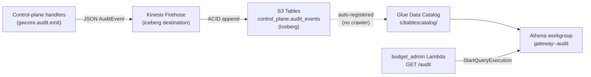

The control-plane audit trail is an append-only stream of every mutating control-plane call and every authorization decision (allow **and** deny), landed by Kinesis Firehose into an Apache Iceberg table on Amazon S3 Tables (ADR-016 / ADR-017). This page covers the read path: the one-time analytics-integration prerequisite, how Athena addresses the table, the canned example queries, and the admin `GET /audit` endpoint.

The audit pipeline is gated behind `enable_audit_pipeline` and the query surface behind `enable_audit_query` — both default **off**. Enable them together to stand up the pipeline plus the Athena workgroup, named queries, and results bucket.

## Architecture



## Prerequisite: enable the analytics integration

:::caution
Athena cannot see any S3 Tables until the **"Integration with AWS analytics services"** toggle is enabled once per account per Region. This is a one-time bootstrap and is **not** a first-class Terraform resource today — enable it before relying on the query surface.
:::

Enable it from the S3 console (**Table buckets → Enable integration**), or via the Lake Formation / Glue API. Enabling it:

- creates the top-level Glue catalog `s3tablescatalog`,
- creates the IAM service role `S3TablesRoleForLakeFormation`,
- auto-populates each table bucket as a child sub-catalog `s3tablescatalog/<bucket>`, each namespace as a Glue database, and each table as a Glue table (no crawler required).

If the Catalog/Database fields are empty in the Athena editor for the audit table, the integration is not enabled in that Region.

The gateway runs in `us-east-1`, a core Region, so **IAM access mode** suffices. Outside the core Regions the integration additionally requires AWS Lake Formation, and the query principal must be granted `Super` (`ALL`) on the child catalog `<account-id>:s3tablescatalog/<bucket>` (a commented, marked-unverified block is included in `modules/audit_query/main.tf`).

## Catalog addressing

Athena reaches S3 Tables through the Glue Data Catalog — there is no separate connector. In the Athena editor the **data source stays `AwsDataCatalog`**; you select the catalog `s3tablescatalog/<bucket>` and the database `control_plane`.

| Element | Value |
|---|---|
| Data source | `AwsDataCatalog` |
| Catalog | `s3tablescatalog/<project>-<env>-audit` |
| Database (namespace) | `control_plane` |
| Table | `audit_events` (control-plane trail), `guardrail_events` (ADR-017) |
| Fully-qualified name | `"s3tablescatalog/<bucket>"."control_plane"."audit_events"` |

In raw SQL, fully-qualify the three-part name (the canned named queries do this). Alternatively, pass the sub-catalog via the `StartQueryExecution` `QueryExecutionContext` (`Catalog` + `Database`), which is what the `GET /audit` Lambda does.

## The audit_events schema

The `audit_events` columns are defined by the **writer** — the `gwcore.audit.AuditEvent` dataclass — not by Terraform (Firehose evolves the Iceberg schema on first write). All names are lowercase (S3 Tables / Glue federation rejects capitalized names).

| Column | Type | Notes |
|---|---|---|
| `action` | string | e.g. `team.create`, `routing.update`, `pricing.delete` |
| `actor` | string | principal `sub` |
| `resource` | string | resource id acted on |
| `decision` | string | `allow` \| `deny` |
| `status` | int | HTTP status |
| `team` | string | team the record belongs to |
| `source_ip` | string | caller source IP |
| `correlation_id` | string | API Gateway request id |
| `before` | json \| null | prior state on mutations (heavy; not returned by default) |
| `after` | json \| null | new state on mutations (heavy; not returned by default) |
| `detail` | string | free-form detail / error code |
| `ts` | string | ISO-8601 UTC timestamp |

:::note
`ts` is an ISO-8601 **string**, not a native timestamp. Wrap it in `from_iso8601_timestamp(ts)` for every range filter or ordering. `before`/`after` are nested JSON — reach into them with `json_extract` if needed.
:::

:::caution[Dual-writer caveat]
The legacy `cost_attribution` pipeline writes a **different** 14-column usage record to the same `AUDIT_FIREHOSE_STREAM` env var used by the legacy `audit_log` module. The Iceberg `control_plane.audit_events` table described here is fed by `gwcore.audit.emit()` (the `AuditEvent` shape) through a **separate** Firehose stream created by the `audit_pipeline` module. This audit query surface targets `control_plane.audit_events` only; do not repoint `cost_attribution`.
:::

## Example queries

The `audit_query` module stores these as `aws_athena_named_query` resources and ships the same SQL as standalone files under `infrastructure/modules/audit_query/queries/`. Each fully-qualifies the catalog with a `<BUCKET>` placeholder (Terraform substitutes the real table-bucket name) and filters time with `from_iso8601_timestamp`.

### Governed records for a team over a period

This is the query behind `GET /audit`. `team` and the ISO-8601 bounds are bound as parameters.

```sql
SELECT action, actor, resource, decision, status, team, source_ip,
       correlation_id, detail, ts
FROM "s3tablescatalog/<BUCKET>"."control_plane"."audit_events"
WHERE team = ?
  AND from_iso8601_timestamp(ts)
      BETWEEN from_iso8601_timestamp(?) AND from_iso8601_timestamp(?)
ORDER BY from_iso8601_timestamp(ts) DESC
LIMIT 100;
```

### Who was blocked (denials)

```sql
SELECT ts, actor, team, action, resource, status, source_ip, correlation_id, detail
FROM "s3tablescatalog/<BUCKET>"."control_plane"."audit_events"
WHERE decision = 'deny'
  AND from_iso8601_timestamp(ts)
      BETWEEN from_iso8601_timestamp(?) AND from_iso8601_timestamp(?)
ORDER BY from_iso8601_timestamp(ts) DESC;
```

### Control-plane mutations by actor

```sql
SELECT actor, action, COUNT(*) AS mutation_count,
       MIN(from_iso8601_timestamp(ts)) AS first_seen,
       MAX(from_iso8601_timestamp(ts)) AS last_seen
FROM "s3tablescatalog/<BUCKET>"."control_plane"."audit_events"
WHERE decision = 'allow'
  AND action LIKE '%.%'
  AND action NOT LIKE '%.access'
  AND from_iso8601_timestamp(ts)
      BETWEEN from_iso8601_timestamp(?) AND from_iso8601_timestamp(?)
GROUP BY actor, action
ORDER BY mutation_count DESC;
```

### Last-24h tail

```sql
SELECT ts, decision, status, actor, team, action, resource, source_ip, correlation_id
FROM "s3tablescatalog/<BUCKET>"."control_plane"."audit_events"
WHERE from_iso8601_timestamp(ts) >= (current_timestamp - interval '24' hour)
ORDER BY from_iso8601_timestamp(ts) DESC
LIMIT 500;
```

:::tip
`CREATE VIEW` is unsupported on S3 Tables via Athena, so these canned queries are `aws_athena_named_query` resources, not views. Query-result reuse is also unavailable for S3 Tables, so the results bucket is treated as disposable (lifecycle-expired).
:::

## The GET /audit endpoint

`GET /audit` is served by the existing `budget_admin` Lambda (no separate Lambda is stood up) behind the admin API Gateway with the Cognito authorizer.

| Aspect | Value |
|---|---|
| Method / path | `GET /audit` |
| Query params | `team` (required), `start` (required, ISO-8601), `end` (required, ISO-8601), `limit` (optional, 1–1000, default 100) |
| Auth | Admin scope (`https://gateway.internal/admin`) required — see [Security](security.md) |
| Isolation | ADR-008 team-isolation guard: a non-admin may read only their own `team`; an empty team claim cannot bypass |
| Response | The `page()` envelope: `{ items, count, next_cursor }` |

Example:

```bash
curl -s "$ADMIN_API/audit?team=platform&start=2026-06-01T00:00:00Z&end=2026-06-30T23:59:59Z&limit=50" \
  -H "Authorization: Bearer $ADMIN_TOKEN"
```

Each item is an `AuditEvent`-shaped object: `action`, `actor`, `resource`, `decision`, `status`, `team`, `source_ip`, `correlation_id`, `detail`, `ts`. The heavy `before`/`after` JSON columns are omitted by default; query them directly in Athena when you need the full mutation diff.

Behavior notes:

- **Reads are not audited.** Only mutations and authz denials emit an `AuditEvent`, so `GET /audit` does not write to the trail.
- The `team` value is bound as an Athena execution parameter, never interpolated into the SQL text.
- If the audit surface is not wired (workgroup env unset), the endpoint returns a clean `502` rather than failing.

The Lambda reads its configuration from environment variables set by the `audit_query` Terraform module: `AUDIT_ATHENA_WORKGROUP`, `AUDIT_ATHENA_CATALOG`, and `AUDIT_ATHENA_DATABASE`. The module also attaches a least-privilege IAM policy (Athena workgroup + `s3tables` read + Glue read + results-bucket read/write) to the Lambda role.

See [Monitoring and Observability](monitoring.md) for the log-based telemetry pipeline and [Admin API](admin-api.md) for the other admin endpoints.
