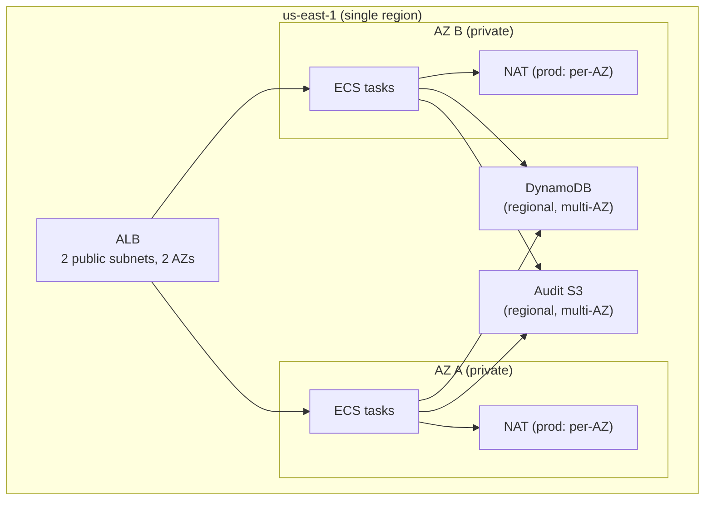

This runbook is an honest statement of what the AI Gateway can and cannot recover from today. The gateway is a **single-region** deployment (us-east-1) with **multi-AZ** resilience inside that region. It survives the loss of an Availability Zone; it does **not** yet survive the loss of the region. That gap is documented here, not solved — treat a full region loss as an accepted, tracked risk rather than a runbook you can execute.

## Current Posture

| Dimension | Today | Notes |
|---|---|---|
| Region | Single — us-east-1 | No standby region, no cross-region replication of state |
| Availability Zones | Multi-AZ (2) | ALB in 2 public subnets; ECS tasks across 2 private subnets |
| Data-plane compute | ECS Fargate, autoscaled across 2 AZs | Survives one AZ loss (tasks reschedule in the healthy AZ) |
| Egress | NAT gateway(s) | Per-env posture below |
| Durable state | DynamoDB + audit S3 bucket | Regional AWS-managed durability |
| Config | Terraform/Terragrunt in git + S3 state | Infra is reproducible from code |

## RTO / RPO Framing

The team has not committed hard, contracted RTO/RPO numbers, and this runbook does not invent them. What can be stated from the architecture:

- **Within-region, single-AZ loss:** near-zero RPO for durable state (DynamoDB and S3 are multi-AZ by design) and low RTO — ECS reschedules tasks into the healthy AZ automatically, and the ALB stops routing to the failed AZ's targets.
- **Full region loss:** **undefined RTO/RPO — this is the documented gap.** There is no warm standby in a second region, so recovery would require standing up the stack from Terraform in a new region and restoring/replaying state. Set explicit RTO/RPO targets before treating region-failover as a supported operation.

:::caution
Do not quote an RTO/RPO to a customer or in an incident from this page. The numbers above are qualitative. Commit specific targets in a follow-up before promising them.
:::

## Durable State

Recovery hinges on what survives. These stores hold the state that matters:

| Store | Holds | Durability |
|---|---|---|
| **DynamoDB** — teams, budgets, usage, routing configs | Team registrations, budget definitions + accumulated usage, routing rules | AWS-managed, multi-AZ within region; point-in-time recovery if enabled on the table |
| **Audit S3 bucket** (`ai-gateway-{env}-audit-logs`) | Append-only usage/audit records | `force_destroy = false`, public access blocked, 90-day → STANDARD_IA, 365-day expiry |
| **Terraform state** (S3 + DynamoDB lock) | Infrastructure definition | One state file per environment; the stack is reproducible from git + this state |
| **Secrets Manager** (`ai-gateway/*`) | Provider API keys | KMS-encrypted; must be re-populated (not `REPLACE_ME`) in any rebuild — see [Security](security.md) |

:::note
DynamoDB is the durable system of record for control-plane state; the audit S3 bucket is the durable system of record for the usage/billing trail. Neither is currently replicated to a second region — that is part of the region-loss gap.
:::

## Audit Trail as a Recovery Reference

The cost-attribution Lambda writes every usage record to a **Kinesis Firehose → S3 (Parquet)** pipeline with a **Glue Catalog** table (`gateway_audit_log`), queryable via Athena. It is enabled with `enable_audit_log = true` (`infrastructure/modules/audit_log/`).

- Records are partitioned by `year`/`month`/`day` and retained 365 days (transitioning to STANDARD_IA at 90 days).
- Because the trail is append-only and independent of the DynamoDB counters, it is the authoritative source for reconstructing per-team usage if the DynamoDB usage rows are ever lost or corrupted.
- **Attribution caveat:** if the gateway ran with `enable_jwt_auth = false`, audit rows for that window carry `unverified-*` teams (see [Incident Response](incident-response.md)). Reconstruction inherits that limitation for the affected period.

:::note
A managed **Iceberg-on-S3-Tables** audit surface with richer Athena querying is planned as a follow-up. Today's durable audit trail is the Parquet + Glue + Athena pipeline described above; do not assume Iceberg tables exist until that work lands.
:::

## Multi-AZ Resilience (AZ-Loss Scenario)

**Egress posture differs by environment** (see [ADR-003](/ai-gateway/adrs/003-single-nat-gw-with-vpc-endpoints/) and its addendum):

- **prod:** one NAT gateway **per AZ** (`single_nat_gateway = false`). Outbound LLM provider calls survive the loss of one AZ — the surviving AZ keeps its own NAT path. This is the multi-AZ NAT change delivered alongside the AppConfig rollback wiring ([T4]).
- **dev:** a **single** shared NAT gateway (`single_nat_gateway = true`, the cost-optimized default). If that NAT's AZ fails, outbound non-Bedrock provider calls from the affected path degrade until the AZ recovers. This is an accepted dev trade-off, not a defect.

In both environments, AWS service traffic (ECR, CloudWatch Logs, Secrets Manager, S3) uses VPC endpoints and does not depend on the NAT gateway, so image pulls, logging, and secret fetches are resilient to NAT/AZ failure ([ADR-003](/ai-gateway/adrs/003-single-nat-gw-with-vpc-endpoints/)).

## What Is NOT Covered

Be explicit about the boundary of this runbook:

- **Region loss (us-east-1 unavailable):** not recoverable within a defined objective today. No standby region, no cross-region replication of DynamoDB or the audit bucket. Recovery would be a manual rebuild from Terraform in another region plus state restore — treat as a tracked gap, not an operation.
- **Cross-region failover / active-active:** not implemented.
- **Point-in-time restore of DynamoDB:** only available if PITR is enabled on the specific table; confirm per table before relying on it.
- **Retroactive attribution repair:** `unverified-*` windows cannot be reattributed after the fact (see [Incident Response](incident-response.md)).

:::danger
If us-east-1 experiences a full regional outage, there is no push-button failover. Escalate to the platform owner and incident commander (see [On-Call Escalation](on-call.md)); recovery is a coordinated rebuild, and the RTO is currently undefined. Closing this gap requires a deliberate multi-region project, not an incident-time improvisation.
:::
