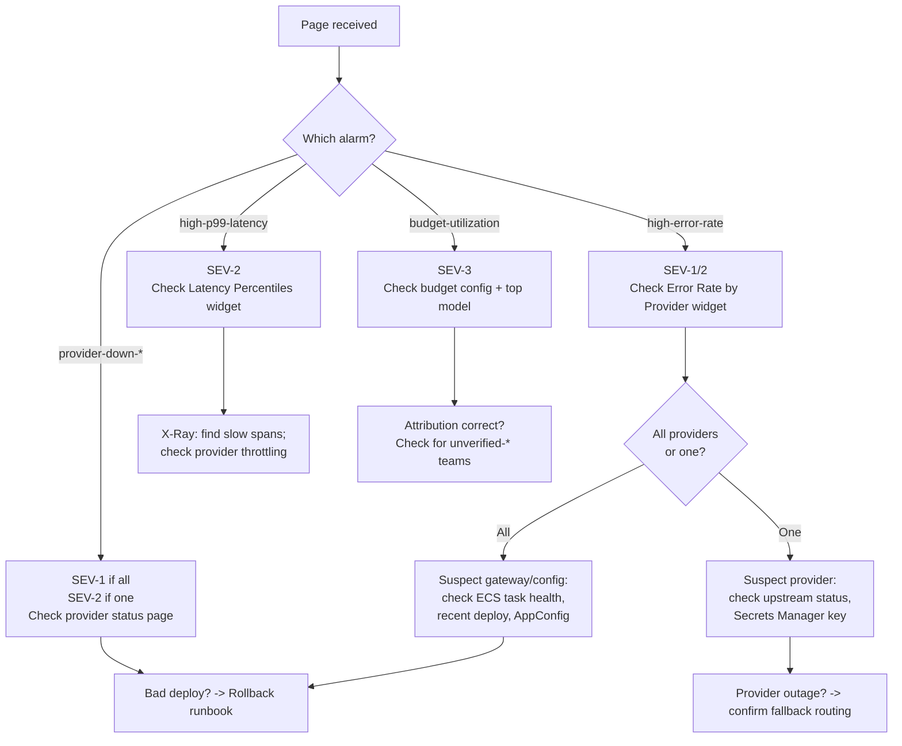
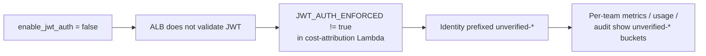

This runbook is the first thing to open when the AI Gateway pages. It maps each CloudWatch alarm to a severity, a likely cause, and a concrete first-response action. Everything here references signals that already exist: the alarms in the observability module, the operational dashboard, and the saved Logs Insights queries documented in [Monitoring](monitoring.md).

The gateway is a two-plane system ([ADR-014](/ai-gateway/adrs/014-two-plane-architecture-split/)): a high-volume **data plane** (WAFv2 → ALB → agentgateway on ECS Fargate) and a low-volume **control plane** (API Gateway → Lambda). Most inference incidents live in the data plane; attribution and admin incidents live in the control plane and its cost-attribution Lambda.

## Severity Levels

Severity drives who is paged and how fast. See [On-Call Escalation](on-call.md) for the paging tiers and roles.

| Severity | Definition | Example Trigger | Response Target |
|---|---|---|---|
| **SEV-1** | Gateway is down or erroring for most traffic | `high-error-rate` sustained; all `provider-down-*` firing at once; ALB 5xx at 100% | Immediate page, primary on-call engages now |
| **SEV-2** | Degraded but serving; one provider or one dimension impaired | Single `provider-down-*`; `high-p99-latency`; error rate elevated but below alarm | Page primary on-call; engage within the on-call SLA |
| **SEV-3** | Cost, attribution, or correctness issue with no availability impact | `budget-utilization`; per-team usage shows `unverified-*` buckets; `UnknownModelPrice` non-zero | Ticket + business-hours follow-up |

:::note
Alarm names follow the pattern `ai-gateway-{environment}-{alarm}` (for example, `ai-gateway-prod-high-error-rate`). Alarm ARNs are exported by the observability module as `alarm_arns` (`infrastructure/modules/observability/outputs.tf`).
:::

## Triage Flow

## Alarm Playbook

Each alarm below is a real CloudWatch alarm defined in `infrastructure/modules/observability/alarms.tf`. All alarms publish to the SNS topics in `alarm_topic_arns` and also send an OK notification when they clear.

### `high-error-rate`

- **What it means:** More than `error_rate_threshold_pct` percent of requests returned 4xx/5xx for `error_rate_evaluation_minutes` consecutive minutes. Computed from the `RequestCount` metric (namespace `AIGateway`) with the `StatusClass=error` dimension over total requests.
- **First response:**
  1. Open the dashboard `ai-gateway-{environment}` → **Error Rate by Provider** widget to see whether errors are broad or isolated to one provider.
  2. Run the saved query `ai-gateway/error-rate-by-provider` (see [Monitoring](monitoring.md)) or `./scripts/cw-queries.sh errors` to break errors down by provider and status code.
  3. If errors span **all** providers, suspect the gateway itself: check ECS service events (`ai-gateway-gateway` on cluster `ai-gateway-{environment}`) and whether a deploy or config change landed recently. Proceed to [Rollback](rollback.md).
  4. If errors are isolated to **one** provider, treat it as a provider-side incident (see `provider-down-*` below).

:::caution
`high-error-rate` is also the trigger wired to AppConfig deployment auto-rollback (see [Rollback](rollback.md)). If a config deployment is in its bake window when this alarm fires, AppConfig may already be rolling the config back — confirm before making manual changes so you do not fight the automation.
:::

### `high-p99-latency`

- **What it means:** The p99 of the `ResponseTime` metric (namespace `AIGateway`) exceeded `p99_latency_threshold_ms` for `latency_evaluation_minutes` minutes.
- **First response:**
  1. Open the dashboard → **Latency Percentiles by Provider (ms)** widget, or run `ai-gateway/latency-percentiles-by-provider` / `./scripts/cw-queries.sh latency`.
  2. Inspect X-Ray traces for slow spans — a single slow provider usually shows up as one provider's p99 diverging.
  3. Common causes: upstream provider throttling, a large-context model getting more traffic, or NAT/network egress pressure. Latency alone (no error spike) is usually SEV-2.

### `provider-down-*`

There is one alarm per provider — `provider-down-bedrock`, `provider-down-openai`, `provider-down-anthropic`, and `provider-down-google` (the `providers_list` in `infrastructure/modules/observability/main.tf`).

- **What it means:** That provider recorded zero `RequestCount` for `provider_down_minutes` minutes. Missing data is treated as breaching, so a provider that stops receiving any traffic will alarm.
- **First response:**
  1. Confirm whether the provider is genuinely erroring or just idle (low traffic can trip this on a quiet provider).
  2. Check the provider's public status page and, if requests are failing auth, verify the provider key in Secrets Manager (`ai-gateway/{provider}-api-key`) is set and not still `REPLACE_ME` (see [Security](security.md)).
  3. If **all four** provider-down alarms fire together, this is a gateway-wide outage, not a provider outage — treat as SEV-1 and go to the `high-error-rate` / [Rollback](rollback.md) path.
  4. If a single provider is down and fallback routing is enabled, confirm traffic is failing over to the healthy lane before declaring customer impact.

### `budget-utilization`

- **What it means:** Daily `EstimatedCostUsd` (namespace `AIGateway`, summed over 24h) exceeded `budget_alarm_threshold_pct` of `budget_limit_daily_usd`. This is a cost signal, not an availability signal — SEV-3.
- **First response:**
  1. Identify the top spender using the Usage API (`GET /usage/{team}`, see [Admin API](admin-api.md)) or the per-team cost metrics.
  2. Before assuming a real overspend, **rule out broken attribution** — if teams show up as `unverified-*` the cost may be real but mis-labelled. See the degradation path below.
  3. Escalate to the control-plane owner for a budget decision; this rarely requires a data-plane change.

## Degradation Path: JWT Auth Not Enforced

This is the most common silent-degradation mode and is easy to misread as a data problem.

When `enable_jwt_auth = false` (the current default in both `dev.tfvars` and `prod.tfvars`), the ALB is **not** validating Cognito JWTs, so the `x-amzn-oidc-data` header the gateway forwards is attacker-spoofable. Terraform mirrors the flag into the cost-attribution Lambda as `JWT_AUTH_ENFORCED`. When that is not `true`, the Lambda refuses to trust the header: rather than dropping the identity, it prefixes the resolved team and user with `unverified-` (`src/cost_attribution/handler.py`, `_extract_identity` around line 122). This is deliberate — it keeps attribution flowing while making the untrusted origin obvious.

**Symptom:** Per-team cost and usage metrics, DynamoDB usage rows, and audit records show `unverified-<team>` / `unverified-<user>` buckets instead of real team names. Budget alerts and the `budget-utilization` alarm may look wrong because spend is landing under `unverified-*` rather than the real team.

**Detection:**

1. Query per-team metrics or run `GET /teams` vs. the teams appearing in usage — a wave of `unverified-*` teams is the tell.
2. Confirm the environment's `enable_jwt_auth` value in the tfvars (`infrastructure/environments/{env}.tfvars`) or Terragrunt inputs.

**Remediation:**

1. Confirm ALB JWT validation is on: set `enable_jwt_auth = true` (requires a `certificate_arn` and the Cognito pool — see [Security](security.md)). This flips the ALB HTTPS listener to the `jwt-validation` action.
2. Terraform then sets `JWT_AUTH_ENFORCED = true` on the Lambda automatically (`infrastructure/main.tf`), and new records attribute to verified teams.
3. Historic `unverified-*` rows are not rewritten — treat them as a bounded, dated gap and note the window in the incident ticket.

:::danger
Do not "fix" `unverified-*` attribution by editing the Lambda or DynamoDB. The prefix is a correct safety behavior when auth is off; the only real fix is enabling ALB JWT validation. Suppressing the prefix would silently trust a spoofable header.
:::

## After the Incident

- Capture the alarm(s) that fired, the dashboard widgets consulted, and the queries run.
- If a config or image change caused it, link the [Rollback](rollback.md) actions taken.
- File follow-ups for any single-region or single-AZ exposure surfaced during the incident — see [Disaster Recovery](disaster-recovery.md) for the current posture and documented gaps.
