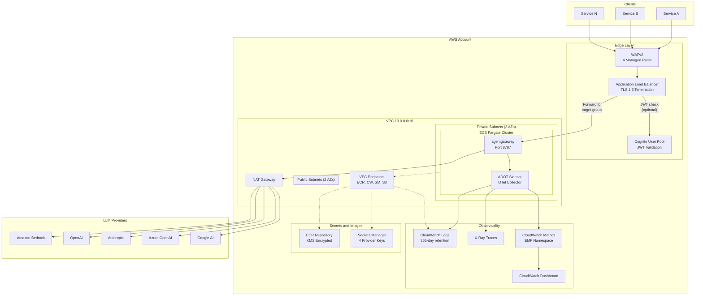
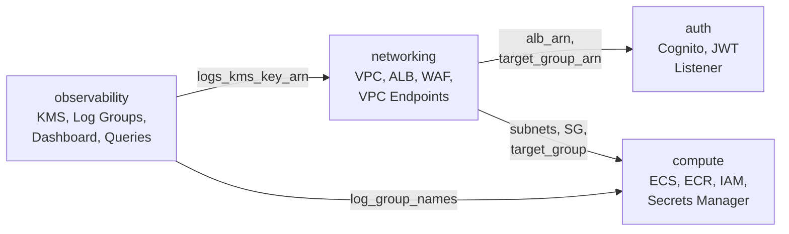

## Audience

This guide is for **infrastructure engineers and platform team members** who deploy, operate, and maintain the AI Gateway. It assumes familiarity with AWS, Terraform, and container orchestration on ECS Fargate.

## What This Section Covers

| Guide | Description |
|---|---|
| [Deployment](deployment.md) | Terraform workflows, backend configuration, module structure, first-time setup |
| [Environments](environments.md) | Dev vs prod configuration, Terragrunt multi-environment setup, customizations |
| [Security](security.md) | WAFv2, JWT auth, Cognito, Secrets Manager, network isolation, CI security pipeline |
| [Monitoring](monitoring.md) | CloudWatch logs/dashboards, OTel collector, saved queries, key metrics |
| [Feature Toggles](features.md) | Multi-client, fallback routing, cost attribution, guardrails, prompt caching, rate limiting, audit log, SSO |
| [Admin API](admin-api.md) | Admin API endpoints for teams, budgets, pricing, routing, and usage |
| [Upgrading](upgrading.md) | Bump the agentgateway data-plane image, upgrade Terraform providers, and enable new features |
| [Incident Response](incident-response.md) | Severity levels, the alarms that fire, first-response steps, and the JWT-not-enforced degradation path |
| [Rollback](rollback.md) | Reverting the gateway image, AppConfig auto-rollback, routing/pricing reverts, and Terraform reverts |
| [On-Call Escalation](on-call.md) | Escalation tiers, what pages on which alarm, ownership, and comms |
| [Disaster Recovery](disaster-recovery.md) | Single-region posture, RTO/RPO framing, durable state, multi-AZ resilience, and the region-loss gap |

## Architecture Overview

The AI Gateway runs [agentgateway](https://github.com/agentgateway/agentgateway) — a Rust LLM/MCP proxy on a distroless base, pinned by image digest ([ADR-017](/ai-gateway/adrs/017-agentgateway-data-plane-spike/)) — on ECS Fargate behind an Application Load Balancer with Cognito M2M authentication and WAFv2 protection. All infrastructure is defined as Terraform with 17 modules.

## Module Dependency Graph

The root Terraform module wires together 4 local modules in a specific dependency order. The `observability` module must be created first because it provides the KMS key used by other modules for log encryption.

## Key Design Decisions

- **Single NAT Gateway** -- cost-optimized for non-critical workloads; upgrade to per-AZ NAT for production HA requirements.
- **agentgateway as the data-plane image** -- the upstream agentgateway image is pinned by digest and re-tagged into ECR (no layers added); see [ADR-017](/ai-gateway/adrs/017-agentgateway-data-plane-spike/).
- **ADOT sidecar** -- the AWS Distro for OpenTelemetry collector runs as a sidecar container in each ECS task, exporting traces to X-Ray and metrics via EMF.
- **S3 + DynamoDB backend** -- Terraform state is stored in S3 with DynamoDB locking, one state file per environment.
- **ALB JWT validation** -- native ALB action (no Lambda authorizer) validates Cognito-issued JWTs, requiring AWS provider v6.22+.