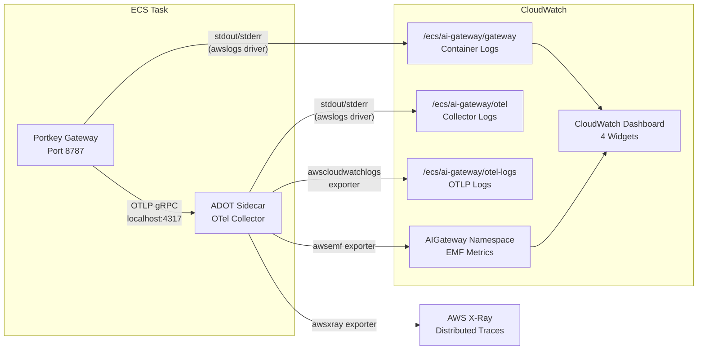

The AI Gateway exports telemetry through three channels: structured logs to CloudWatch Logs, distributed traces to X-Ray, and custom metrics via CloudWatch Embedded Metric Format (EMF). An ADOT sidecar container in each ECS task handles the export pipeline.

## Telemetry Pipeline



## CloudWatch Log Groups

| Log Group | Source | Retention | Encryption |
|---|---|---|---|
| `/ecs/ai-gateway/gateway` | Portkey gateway container (pino JSON via Fastify) | 365 days | KMS (`alias/ai-gateway-logs`) |
| `/ecs/ai-gateway/otel` | ADOT sidecar container operational logs | 365 days | KMS (`alias/ai-gateway-logs`) |
| `/ecs/ai-gateway/otel-logs` | OTLP logs exported by the collector pipeline | 365 days | KMS (`alias/ai-gateway-logs`) |
| `/ecs/ai-gateway/metrics` | EMF-formatted metrics from the collector | 365 days | KMS (`alias/ai-gateway-logs`) |
| `aws-waf-logs-ai-gateway-{env}` | WAF request logs (only when WAF is enabled) | 365 days | KMS (`alias/ai-gateway-logs`) |

## OpenTelemetry Collector Configuration

The ADOT sidecar runs the AWS Distro for OpenTelemetry (`public.ecr.aws/aws-observability/aws-otel-collector:latest`) with the following pipeline configuration (defined in `infrastructure/otel-config.yaml`):

### Receivers

| Receiver | Protocol | Endpoint |
|---|---|---|
| OTLP | gRPC | `localhost:4317` |
| OTLP | HTTP | `localhost:4318` |

### Processors

| Processor | Configuration |
|---|---|
| `memory_limiter` | `check_interval: 1s`, `limit_mib: 100` |
| `batch` | `timeout: 5s`, `send_batch_size: 512` |
| `resource` | Upserts `service.name = ai-gateway` |

### Exporters and Pipelines

| Pipeline | Processors | Exporter | Destination |
|---|---|---|---|
| **Traces** | memory_limiter, batch | `awsxray` | AWS X-Ray |
| **Metrics** | memory_limiter, batch | `awsemf` | CloudWatch Metrics (namespace: `AIGateway`, log group: `/ecs/ai-gateway/metrics`) |
| **Logs** | memory_limiter, batch | `awscloudwatchlogs` | CloudWatch Logs (`/ecs/ai-gateway/otel-logs`) |

:::note
The `memory_limiter` processor is placed first in each pipeline to protect the sidecar (allocated 256 MiB) from OOM. It hard-limits memory at 100 MiB.
:::


## Saved CloudWatch Logs Insights Queries

Four pre-built queries are deployed as CloudWatch saved queries, targeting the gateway log group. All query the pino JSON logs emitted by the Portkey Fastify server.

### 1. Requests per Hour by Provider

**Saved as:** `ai-gateway/requests-per-hour-by-provider`

```
fields @timestamp, @message
| filter ispresent(responseTime)
| stats count(*) as requests by bin(1h), `req.headers.x-portkey-provider` as provider
| sort bin(1h) desc
```

### 2. Error Rate by Provider

**Saved as:** `ai-gateway/error-rate-by-provider`

```
fields @timestamp, @message
| filter ispresent(res.statusCode)
| stats count(*) as total,
        sum(res.statusCode >= 400) as errors,
        (sum(res.statusCode >= 400) / count(*)) * 100 as error_pct
  by `req.headers.x-portkey-provider` as provider
| sort error_pct desc
```

### 3. Latency Percentiles by Provider

**Saved as:** `ai-gateway/latency-percentiles-by-provider`

```
fields @timestamp, responseTime
| filter ispresent(responseTime)
| stats pct(responseTime, 50) as p50,
        pct(responseTime, 95) as p95,
        pct(responseTime, 99) as p99,
        avg(responseTime) as avg_ms
  by `req.headers.x-portkey-provider` as provider
| sort p99 desc
```

### 4. Requests by Endpoint

**Saved as:** `ai-gateway/requests-by-endpoint`

```
fields @timestamp, req.url
| filter ispresent(req.url)
| stats count(*) as requests by `req.url` as endpoint
| sort requests desc
| limit 20
```

## CloudWatch Dashboard

The dashboard `ai-gateway-{environment}` contains 4 widgets arranged in a 2x2 grid:

| Position | Widget | Type | Data Source |
|---|---|---|---|
| Top-left | **Requests per Hour by Provider** | Time series | Gateway log group (Logs Insights) |
| Top-right | **Error Rate by Provider** | Table | Gateway log group (Logs Insights) |
| Bottom-left | **Latency Percentiles by Provider (ms)** | Table | Gateway log group (Logs Insights) |
| Bottom-right | **Top Endpoints by Request Count** | Table | Gateway log group (Logs Insights) |

:::note
Additional metric widgets for token usage and estimated cost are planned as comments in the dashboard definition and will be activated when the B.3 Cost Attribution Pipeline is enabled.
:::


## Running Queries via CLI

The `scripts/cw-queries.sh` script provides a convenient way to run the saved queries from the command line:

```bash
# Run all 4 queries (default: last 1 hour)
./scripts/cw-queries.sh

# Run a specific query
./scripts/cw-queries.sh requests
./scripts/cw-queries.sh errors
./scripts/cw-queries.sh latency
./scripts/cw-queries.sh endpoints
```

### Environment Variables

| Variable | Default | Description |
|---|---|---|
| `LOG_GROUP` | `/ecs/ai-gateway/gateway` | Target CloudWatch log group |
| `START_TIME` | 1 hour ago (epoch seconds) | Query start time |
| `END_TIME` | Now (epoch seconds) | Query end time |

### Examples

```bash
# Query the last 24 hours
START_TIME=$(date -d '24 hours ago' +%s) ./scripts/cw-queries.sh

# Query a different log group
LOG_GROUP=/ecs/ai-gateway/otel ./scripts/cw-queries.sh

# Query a specific time range
START_TIME=1711000000 END_TIME=1711003600 ./scripts/cw-queries.sh errors
```

:::tip
The script starts an async CloudWatch Logs Insights query, waits 3 seconds, then fetches results. For queries over large time ranges, you may need to check the query status in the CloudWatch console if results show as incomplete.
:::


## Key Metrics to Watch

### Operational Health

| Metric | Source | Healthy Range | Action if Breached |
|---|---|---|---|
| **Request rate** | Logs Insights (requests/hour) | Baseline +/- 50% | Investigate traffic spikes; check if autoscaling is responding |
| **Error rate (4xx + 5xx)** | Logs Insights (error_pct) | < 5% | Check provider API status; review error logs for patterns |
| **p50 latency** | Logs Insights (latency_percentiles) | < 500ms | Normal range varies by model; investigate if suddenly increases |
| **p99 latency** | Logs Insights (latency_percentiles) | < 5000ms | May indicate provider throttling or network issues |

### Infrastructure Health

| Metric | Source | Healthy Range | Action if Breached |
|---|---|---|---|
| **ECS running task count** | CloudWatch ECS metrics | >= `autoscaling_min_capacity` | Check ECS events for task failures; verify health checks |
| **CPU utilization** | CloudWatch ECS metrics | < 70% (autoscaling target) | Autoscaling should handle; increase `autoscaling_max_capacity` if at limit |
| **ALB request count** | CloudWatch ALB metrics | < 500/target (autoscaling target) | Autoscaling should handle; review if tasks are scaling appropriately |
| **ALB 5xx count** | CloudWatch ALB metrics | 0 | Check ECS task health; review gateway logs for crashes |
| **WAF blocked requests** | CloudWatch WAF metrics | Low, non-zero | Review WAF logs for false positives; adjust rules if legitimate traffic is blocked |

### Where to Look

| Signal | First Check | Deep Dive |
|---|---|---|
| High error rate | Dashboard "Error Rate by Provider" widget | Logs Insights: filter by status code and provider |
| Slow responses | Dashboard "Latency Percentiles" widget | X-Ray traces: look for slow spans |
| No traffic | ALB target group health in ECS console | ECS task events and container health checks |
| Task crashes | ECS service events tab | Gateway log group: look for fatal/error level logs |
| WAF blocking | WAF metrics in CloudWatch | WAF log group: `aws-waf-logs-ai-gateway-{env}` |