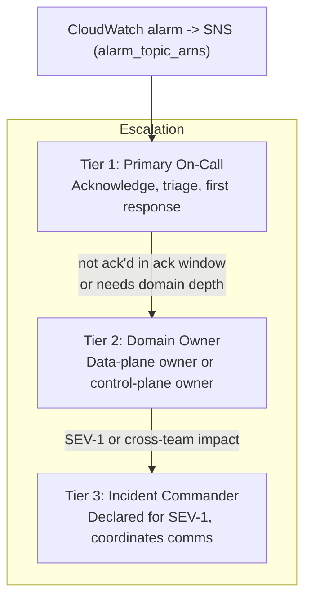

This runbook defines who gets paged, for what, and when it escalates. It is intentionally structural: it uses **role placeholders** (primary on-call, control-plane owner, incident commander) rather than names or pager numbers, so it stays correct as the rotation changes. Fill the roles from your team's rotation tool; the alarm-to-tier mapping below is grounded in the real CloudWatch alarms.

All alarms notify through the SNS topics exported as `alarm_topic_arns` (`infrastructure/modules/observability/outputs.tf`). Point those topics at your paging integration; this page assumes that wiring exists.

## Escalation Tiers

| Tier | Role (placeholder) | Owns | Engages when |
|---|---|---|---|
| **1** | Primary on-call | Acknowledge the page, run [Incident Response](incident-response.md) triage, take first-response actions | Every page |
| **2** | Domain owner (data-plane owner or control-plane owner) | Deep expertise for the affected plane; approves rollbacks and config changes | Tier 1 cannot resolve within the ack window, or the issue needs domain depth |
| **3** | Incident commander | Coordinates a SEV-1: comms, timeline, bridging teams, customer messaging | A SEV-1 is declared, or impact spans multiple teams/systems |

:::note
Ack windows and rotation length are set in your paging tool, not in this repo — this runbook does not invent SLA numbers. Record the agreed ack/response targets in the rotation config and reference them from [Incident Response](incident-response.md) severity levels.
:::

## What Pages on Which Alarm

Every row is a real alarm from `infrastructure/modules/observability/alarms.tf`. Severity mapping matches [Incident Response](incident-response.md).

| Alarm | Default severity | Pages | Primary owner |
|---|---|---|---|
| `high-error-rate` | SEV-1 / SEV-2 | Primary on-call immediately | Data-plane owner |
| `provider-down-*` (all four firing) | SEV-1 | Primary on-call immediately | Data-plane owner |
| `provider-down-*` (single provider) | SEV-2 | Primary on-call | Data-plane owner |
| `high-p99-latency` | SEV-2 | Primary on-call | Data-plane owner |
| `budget-utilization` | SEV-3 | Ticket / business-hours; notify control-plane owner | Control-plane owner |

The four provider alarms are `provider-down-bedrock`, `provider-down-openai`, `provider-down-anthropic`, and `provider-down-google`.

:::caution
`budget-utilization` and `unverified-*` attribution symptoms are **cost/correctness** issues, not availability. Route them to the control-plane owner as tickets. Do not page the data-plane primary out-of-hours for a budget alarm — but do check for the JWT-not-enforced degradation path first (see [Incident Response](incident-response.md)), because it can make a budget alarm look worse than it is.
:::

## Ownership Boundaries

Ownership follows the two-plane split ([ADR-014](/ai-gateway/adrs/014-two-plane-architecture-split/)).

| Domain | Scope | Owner (placeholder) |
|---|---|---|
| **Data plane** | WAFv2, ALB, agentgateway on ECS Fargate, ADOT sidecar, provider egress | Data-plane owner |
| **Control plane** | API Gateway, admin Lambdas (`team_registration`, `budget_admin`, `routing_config`, `pricing_admin`, `usage_api`), cost-attribution Lambda | Control-plane owner |
| **Platform / infra** | Terraform/Terragrunt, networking, KMS, Cognito, alarms, AppConfig | Platform owner |

When an incident crosses planes (for example, `high-error-rate` caused by a bad routing config pushed through the admin API), the primary on-call owns coordination until an incident commander is engaged.

## Communication

- **Acknowledge first.** Ack the page in the paging tool before investigating, so the rotation knows it is being worked.
- **One status channel per incident.** Post the alarm(s) that fired, current severity, and the runbook section in use. Update on state changes, not on a timer.
- **SEV-1 declares an incident commander** who owns external comms and the timeline; responders report to the commander.
- **Reference, do not duplicate.** Link the specific [Incident Response](incident-response.md) and [Rollback](rollback.md) steps taken rather than re-describing them in chat.

## Handoff

At rotation handoff, the outgoing primary on-call passes:

1. Any open or recently-cleared alarms and their tickets.
2. In-flight rollbacks or AppConfig deployments (see [Rollback](rollback.md)) that are still baking.
3. Known degraded states — notably any environment currently running with `enable_jwt_auth = false`, which produces `unverified-*` attribution (see [Incident Response](incident-response.md)).
4. Any single-region or single-AZ exposure being tracked (see [Disaster Recovery](disaster-recovery.md)).
