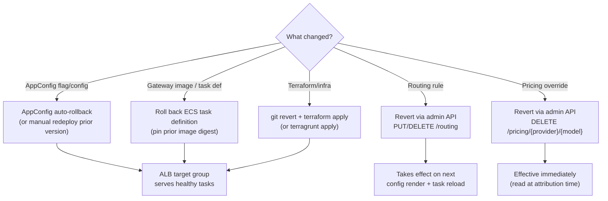

When a change breaks the gateway, this runbook lists every layer you can roll back and the exact cutover point for each. Rollback layers, from fastest to slowest: an in-flight config deploy (AppConfig auto-rollback, seconds), the ECS task definition (image, minutes), a routing or pricing change via the admin API (minutes), and the Terraform/Terragrunt state (slowest, full plan/apply). Start at the layer that changed.

The ALB **target group** is the cutover point for the data plane: ECS registers new tasks into the target group and drains old ones, so any image or task-definition rollback flips traffic by swapping which tasks are healthy behind the target group.



## 1. AppConfig Deployment Auto-Rollback (fastest)

The gateway can serve feature flags and dynamic configuration through AWS AppConfig (`enable_appconfig`, off by default). When enabled, AppConfig deployments run with a **CloudWatch alarm monitor** wired to the `high-error-rate` alarm.

- **How it protects you:** During a deployment's bake window, if the pushed config causes 4xx/5xx to spike, `high-error-rate` breaches and AppConfig **automatically rolls the deployment back** to the last-known-good configuration version — no operator action required.
- **Why `high-error-rate` and not latency:** a bad config change trips error rate faster and more cleanly than latency. This wiring is delivered by the multi-AZ NAT and rollback-alarm change ([T4]); the AppConfig module already gates its monitor on a non-empty alarm ARN.
- **If auto-rollback did not fire but the config is bad:** start a new AppConfig deployment pinned to the previous configuration version. Confirm the environment's config profile shows the earlier version number as active.

:::caution
If `high-error-rate` fires while an AppConfig deployment is baking, assume auto-rollback is already in progress. Do not simultaneously force an ECS redeploy — let the config settle, confirm the alarm clears, then decide whether a further rollback layer is needed.
:::

## 2. Roll Back the agentgateway Image (ECS task definition)

The data plane runs the upstream [agentgateway](https://github.com/agentgateway/agentgateway) image **pinned by digest** and re-tagged into ECR — no layers are added ([ADR-017](/ai-gateway/adrs/017-agentgateway-data-plane-spike/)). The pin lives in `versions.env` at the repo root (`AGENTGATEWAY_REF`, `AGENTGATEWAY_VERSION`, `AGENTGATEWAY_IMAGE_DIGEST`), and the running image URI is selected by the `gateway_image` variable.

To roll back to a prior known-good image:

1. **Point `gateway_image` at the previous published image** (by digest is safest — the digest is the immutable contract, the tag is informational):

   ```hcl
   gateway_image = "<account>.dkr.ecr.us-east-1.amazonaws.com/ai-gateway@sha256:<prior-digest>"
   ```

   For Terragrunt, update the `gateway_image` local in `terragrunt/_env/common.hcl`.

2. **Apply**, which registers a new task definition revision:

   ```bash
   terraform plan  -var-file=environments/prod.tfvars
   terraform apply -var-file=environments/prod.tfvars
   ```

3. ECS performs a **rolling deployment**: it launches tasks on the prior image, waits for them to pass the ALB health check (HTTP 200 on port 8787), drains the bad tasks (30s deregistration delay), then stops them. The ECS **deployment circuit breaker is enabled with rollback**, so if the rolled-back tasks themselves fail health checks, ECS reverts the service to the last stable task set on its own.

:::note
For an emergency roll-forward of the *currently deployed* task definition without changing the image (for example, to clear stuck tasks), use the force-new-deployment path from [Deployment](deployment.md):

```bash
aws ecs update-service \
  --cluster ai-gateway-prod \
  --service ai-gateway-gateway \
  --force-new-deployment

aws ecs wait services-stable \
  --cluster ai-gateway-prod \
  --services ai-gateway-gateway
```
:::

## 3. Revert a Routing Config Change

Routing rules are managed through the control-plane [Admin API](admin-api.md) (`/routing`, backed by the `routing_config` Lambda and persisted to DynamoDB).

- Undo a specific rule with `PUT /routing/{id}` (restore prior values) or `DELETE /routing/{id}` (remove it).
- **Timing caveat:** routing changes are persisted to DynamoDB immediately, but they take effect on the **next config render + ECS task reload**, not instantly and not per-team at request time ([ADR-017](/ai-gateway/adrs/017-agentgateway-data-plane-spike/), see also [Feature Toggles](features.md)). A routing rollback is not a hot cutover; if you need traffic changed *now*, roll back at the image/task-definition layer instead.

## 4. Revert a Pricing Change

Pricing overrides are managed via `/pricing` on the [Admin API](admin-api.md) (`pricing_admin` Lambda). Overrides layer on top of the static default price table.

- Remove a bad override with `DELETE /pricing/{provider}/{model}` — this reverts that model to its static default price.
- Correct a wrong override with `PUT /pricing/{provider}/{model}`.
- Pricing is read by the cost-attribution Lambda at metric-emission time, so a revert is effective for **new** records immediately. Already-emitted `EstimatedCostUsd` metrics and DynamoDB usage rows are not retroactively re-priced.

:::tip
If `UnknownModelPrice` metrics are non-zero, a model is being billed at a default estimate rather than a real rate. Add the correct override with `PUT /pricing/{provider}/{model}` instead of rolling anything back — see [Pricing](pricing.md).
:::

## 5. Terraform / Terragrunt Revert (slowest, full infra)

For infrastructure changes (networking, alarms, IAM, AppConfig setup):

1. `git revert` the offending commit (or check out the last-good ref) so the change is auditable.
2. Re-apply:

   ```bash
   # Direct Terraform
   terraform plan  -var-file=environments/prod.tfvars
   terraform apply -var-file=environments/prod.tfvars

   # Terragrunt
   cd terragrunt/prod/
   terragrunt plan
   terragrunt apply
   ```

3. **Review the plan carefully** — pay attention to any resource being destroyed or replaced, especially anything stateful (Cognito pool, DynamoDB tables, S3 buckets).

:::danger
Some resources cannot be casually rolled back. The Cognito User Pool has `deletion_protection = "ACTIVE"`, and DynamoDB tables (teams, budgets, usage, routing configs) and the audit S3 bucket (`force_destroy = false`) hold durable state. A Terraform revert that would destroy these is a data-loss event, not a rollback — stop and escalate to the control-plane owner. See [Disaster Recovery](disaster-recovery.md).
:::

## Choosing the Right Layer

| Symptom | Roll back at | Cutover point |
|---|---|---|
| Errors right after a config/flag deploy | AppConfig (auto or manual redeploy) | Config version (bake monitor) |
| Errors/latency right after an image bump | ECS task definition (`gateway_image`) | ALB target group |
| Wrong provider being chosen | `/routing` admin API | Next render + task reload |
| Wrong cost per model | `/pricing` admin API | Next attribution record |
| Bad infra change (alarms, network, IAM) | `git revert` + Terraform/Terragrunt apply | Depends on resource |
