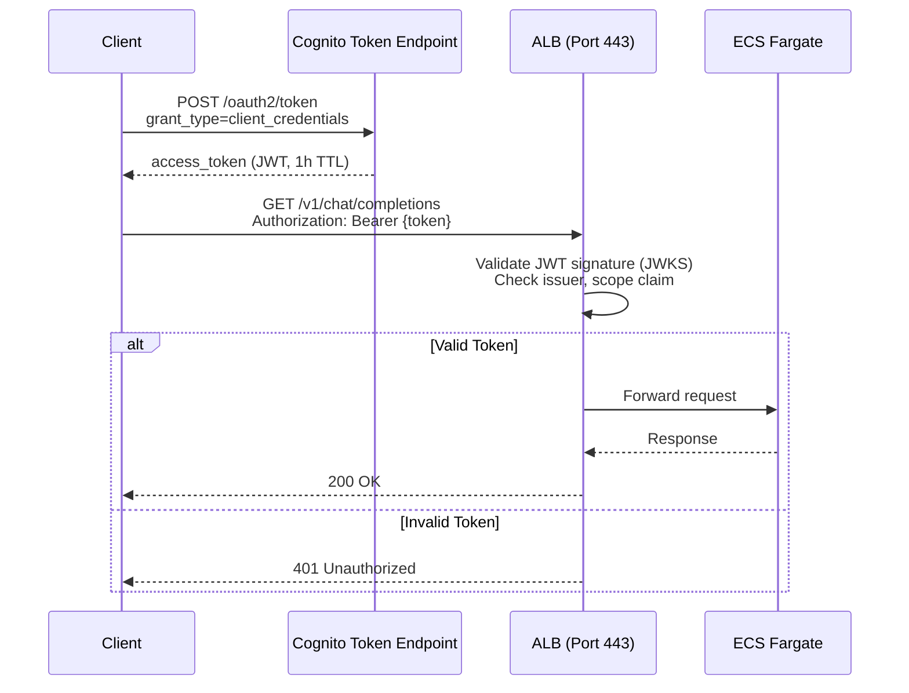
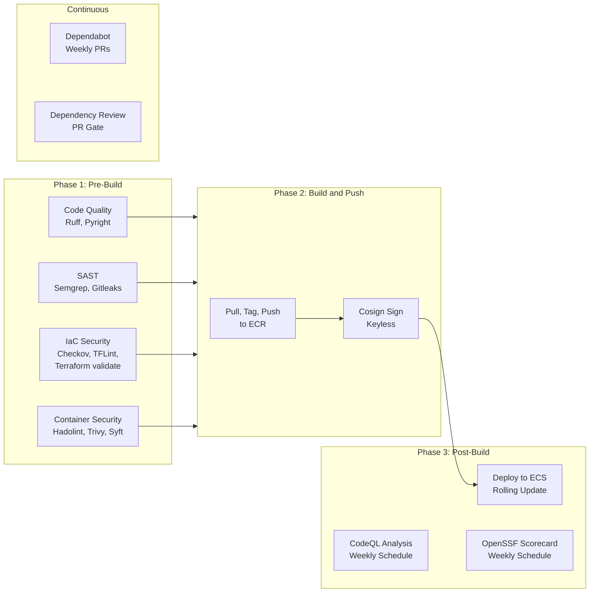

The AI Gateway implements defense in depth across network, application, container, and CI/CD layers. This page covers each security control and how to configure it.

## WAFv2 Rules

WAFv2 is attached to the ALB and is controlled by the `enable_waf` variable (`true` in prod, `false` in dev). When enabled, four rules are evaluated in priority order:

| Priority | Rule Name | Type | Action | Description |
|---|---|---|---|---|
| 1 | `AWSManagedRulesCommonRuleSet` | AWS Managed | Override (none) | OWASP Top 10 protections: SQL injection, XSS, path traversal, etc. |
| 2 | `AWSManagedRulesAmazonIpReputationList` | AWS Managed | Override (none) | Blocks requests from IP addresses with poor reputation (botnets, scanners) |
| 3 | `RateLimitPerIP` | Custom | Block | Rate-limits to **2,000 requests per 5-minute window** per source IP |
| 4 | `AWSManagedRulesKnownBadInputsRuleSet` | AWS Managed | Override (none) | Blocks request patterns known to be associated with exploitation (Log4j, etc.) |

The default action is **Allow** -- only requests matching a blocking rule are rejected.

All rules emit CloudWatch metrics (e.g., `ai-gateway-common-rules`, `ai-gateway-rate-limit`) with sampled request logging enabled.

:::tip
WAF logs are written to a dedicated CloudWatch log group: `aws-waf-logs-ai-gateway-{environment}` with 365-day retention and KMS encryption. Use CloudWatch Logs Insights to analyze blocked requests.
:::


### Enabling WAF

```hcl
# In your tfvars or Terragrunt inputs:
enable_waf = true
```

No other configuration is needed. The WAF ACL, logging, and ALB association are all created automatically when `enable_waf = true`.

## ALB JWT Validation

JWT validation is **on by default** (`enable_jwt_auth = true`) in this reference architecture — a clone-and-apply is authenticated unless you deliberately opt out. When enabled, the ALB replaces its standard HTTPS forward listener with a two-action listener that validates JWTs before forwarding traffic.

:::caution[Secure by default — two inputs are required]
Because `enable_jwt_auth` defaults to `true`, you **must** also set `certificate_arn` (the ACM cert for the HTTPS listener) and `cognito_user_pool_id` (the JWT issuer / JWKS source). A precondition in `infrastructure/guards.tf` **fails `terraform plan`** with an explanatory message if either is empty — this is intentional: without them, JWT validation cannot stand up and the gateway would otherwise serve unauthenticated. To run a deliberately unauthenticated deployment (e.g. a no-cert local smoke test), set `enable_jwt_auth = false` explicitly (this is what `environments/dev.tfvars` does; `environments/prod.tfvars` models the secure default).
:::

### How It Works

1. The client obtains an access token from the Cognito token endpoint using the `client_credentials` grant.
2. The client sends requests with the token in the `Authorization: Bearer <token>` header.
3. The ALB validates the JWT:
    - Verifies the signature against the Cognito JWKS endpoint
    - Checks the `issuer` claim matches the Cognito User Pool
    - Confirms the `scope` claim contains `https://gateway.internal/invoke`
4. If validation passes, the request is forwarded to the ECS target group.
5. If validation fails, the ALB returns HTTP 401 automatically.



### Configuring JWT Auth (on by default)

`enable_jwt_auth` is `true` by default. Provide the two required inputs:

```hcl
# Required whenever enable_jwt_auth = true (the default):
certificate_arn      = "arn:aws:acm:us-east-1:123456789012:certificate/abc-123"
cognito_user_pool_id = "us-east-1_EXAMPLE"
enable_jwt_auth      = true # default — shown for clarity
```

To deliberately run unauthenticated (no cert, e.g. a local smoke test), opt out explicitly:

```hcl
enable_jwt_auth = false
```

:::caution
Enabling JWT auth requires AWS provider version >= 6.22.0, which added the `jwt-validation` ALB listener action type. The `versions.tf` already pins `~> 6.22`.
:::


### Obtaining a Token

Use the provided helper script:

```bash
export GATEWAY_CLIENT_ID="your-client-id"
export GATEWAY_CLIENT_SECRET="your-client-secret"
export GATEWAY_TOKEN_ENDPOINT="https://ai-gateway-prod.auth.us-east-1.amazoncognito.com/oauth2/token"

token=$(./scripts/get-gateway-token.sh)

curl -H "Authorization: Bearer $token" \
  https://gateway.example.com/v1/chat/completions \
  -d '{"model": "gpt-4", "messages": [{"role": "user", "content": "Hello"}]}'
```

## Cognito Configuration

The auth module creates a full Cognito M2M (machine-to-machine) authentication stack:

| Resource | Purpose |
|---|---|
| **User Pool** | Identity store with `deletion_protection = "ACTIVE"` and admin-only user creation |
| **Resource Server** | Defines the `https://gateway.internal` identifier with two scopes: `invoke` and `admin` |
| **User Pool Client** | M2M client using `client_credentials` grant with 1-hour access token validity |
| **User Pool Domain** | Provides the `/oauth2/token` endpoint (e.g., `ai-gateway-prod.auth.us-east-1.amazoncognito.com`) |

### Scopes

| Scope | Identifier | Purpose |
|---|---|---|
| invoke | `https://gateway.internal/invoke` | Required to call gateway API endpoints. Validated by the ALB JWT listener. |
| admin | `https://gateway.internal/admin` | Reserved for administrative operations. Not enforced by default. |

The default M2M client receives both scopes. For multi-client setups, use the B.1 Multi-Client Onboarding feature to issue per-team credentials with fine-grained scope assignments.

## Secrets Manager

Four provider API keys are stored in AWS Secrets Manager, encrypted with a dedicated KMS key:

| Secret Path | Environment Variable | Provider |
|---|---|---|
| `ai-gateway/openai-api-key` | `OPENAI_API_KEY` | OpenAI |
| `ai-gateway/anthropic-api-key` | `ANTHROPIC_API_KEY` | Anthropic |
| `ai-gateway/google-api-key` | `GOOGLE_API_KEY` | Google AI |
| `ai-gateway/azure-api-key` | `AZURE_API_KEY` | Azure OpenAI |

ECS tasks retrieve these secrets at launch via the task execution role, which has `secretsmanager:GetSecretValue` permission scoped to `arn:aws:secretsmanager:*:*:secret:ai-gateway/*`.

:::danger
Secrets are initialized with the value `REPLACE_ME`. Always update them with real API keys after the first deployment. Never commit API keys to version control.
:::


### KMS Encryption

Three dedicated KMS keys are used, all with automatic annual key rotation enabled:

| KMS Key Alias | Purpose |
|---|---|
| `alias/ai-gateway-logs` | Encrypts CloudWatch log groups |
| `alias/ai-gateway-ecr` | Encrypts ECR container images |
| `alias/ai-gateway-secrets` | Encrypts Secrets Manager values |

## Network Security

### VPC Isolation

- ECS tasks run in **private subnets** with no direct internet ingress.
- A **single NAT Gateway** in a public subnet provides outbound internet access (for reaching LLM provider APIs).
- The ALB is deployed in **public subnets** and is the only internet-facing component.
- ALB security group allows inbound on ports **80** and **443** only; egress is restricted to the VPC CIDR.
- ECS security group allows inbound on port **8787** only from the ALB security group; egress is unrestricted (for provider API calls via NAT).

### VPC Endpoints

Four VPC endpoints eliminate the need to route service traffic through the NAT Gateway:

| Endpoint | Type | Service |
|---|---|---|
| S3 | Gateway | `com.amazonaws.{region}.s3` |
| ECR API | Interface | `com.amazonaws.{region}.ecr.api` |
| ECR DKR | Interface | `com.amazonaws.{region}.ecr.dkr` |
| CloudWatch Logs | Interface | `com.amazonaws.{region}.logs` |
| Secrets Manager | Interface | `com.amazonaws.{region}.secretsmanager` |

Interface endpoints are secured by a dedicated security group that allows HTTPS (port 443) from private subnet CIDRs only.

## Container Security

| Control | Implementation |
|---|---|
| **ECR scan-on-push** | Every image pushed to ECR is automatically scanned for vulnerabilities |
| **Immutable tags** | ECR `image_tag_mutability = "IMMUTABLE"` prevents tag overwriting |
| **KMS encryption** | ECR images are encrypted at rest with a dedicated KMS key |
| **Lifecycle policy** | Only the last 10 images are retained; older images are automatically expired |
| **Cosign signing** | The CI pipeline signs images with Sigstore cosign (keyless) after push |

## Security Scanning Pipeline

The CI/CD pipeline runs 12 security tools across three phases. All findings are uploaded as SARIF to the GitHub Security tab.

| Tool | Phase | Target | Purpose |
|---|---|---|---|
| **Semgrep** | Pre-build | Python source | SAST: OWASP Top 10, security audit, Python-specific rules |
| **Gitleaks** | Pre-build | Git history | Secret detection in code and commit history |
| **Checkov** | Pre-build | Terraform | IaC misconfiguration scanning (CIS, SOC2 benchmarks) |
| **Hadolint** | Pre-build | Dockerfiles | Dockerfile best-practice linting |
| **TFLint** | Pre-build | Terraform | Terraform linting and provider-specific checks |
| **Trivy** | Pre-build | Container image | Vulnerability scanning (CRITICAL, HIGH severity) |
| **Syft** | Pre-build | Container image | SBOM generation (CycloneDX format, retained 90 days) |
| **CodeQL** | Post-build | Python source | Semantic code analysis (security + quality queries) |
| **Scorecard** | Post-build | Repository | OpenSSF supply-chain security assessment |
| **Dependency Review** | Post-build | PR diffs | Vulnerability and license check on dependency changes |
| **Dependabot** | Continuous | All ecosystems | Automated dependency updates (Python, Terraform, GitHub Actions) |
| **Cosign** | Post-push | ECR image | Keyless image signing with Sigstore |

### Pipeline Flow



:::note
The pre-build jobs (quality, SAST, IaC, container) run in parallel on every push and PR. The build-and-push job only runs on pushes to `main` and gates on all pre-build jobs passing. CodeQL and Scorecard also run on a weekly schedule to catch newly disclosed vulnerabilities.
:::