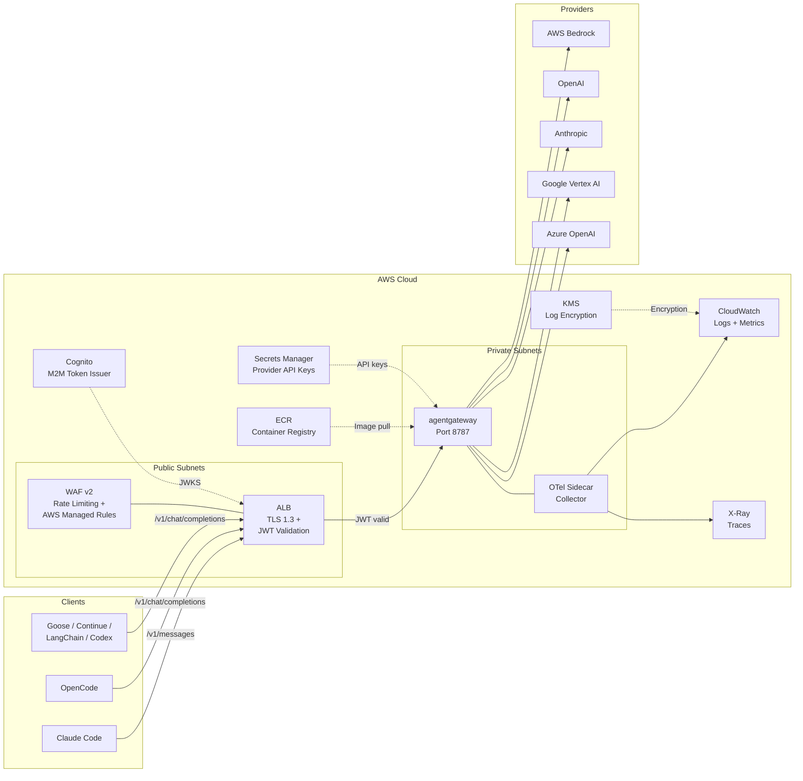
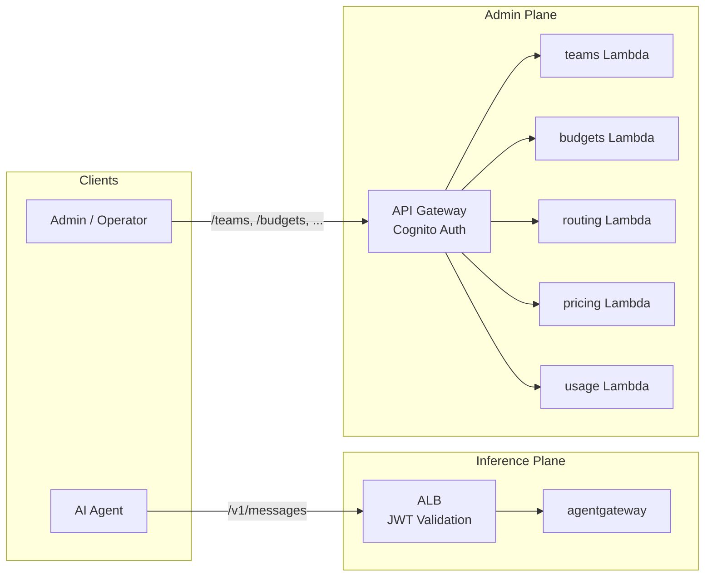
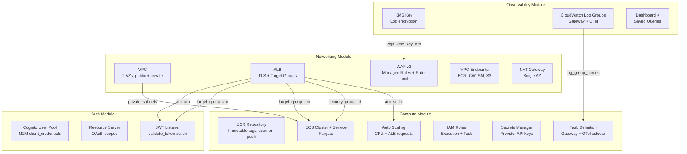
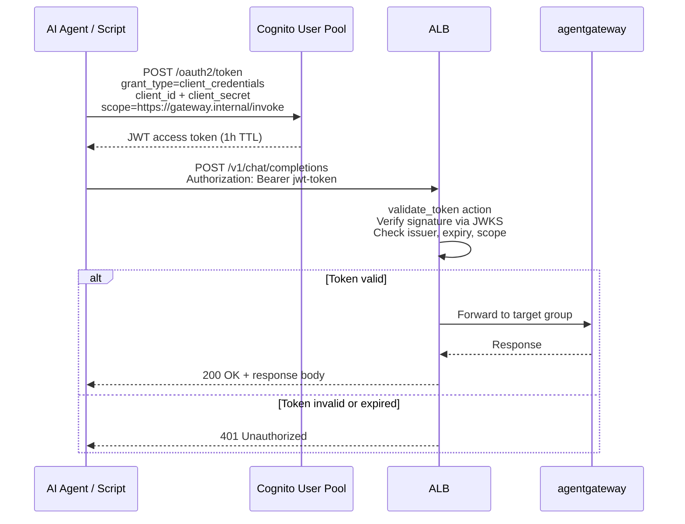

This page provides a complete mental model of the AI Gateway system: how requests flow from client agents through the infrastructure, how modules are organized, and why key design decisions were made.

## High-Level System Architecture

The gateway sits between AI coding agents and LLM model providers, handling authentication, routing, and observability.



## Two-Plane Architecture

The gateway splits traffic into two planes ([ADR-014](/ai-gateway/adrs/014-two-plane-architecture-split/)):

| Plane | Transport | Auth | Endpoints | Traffic Pattern |
|---|---|---|---|---|
| **Inference** | ALB | ALB-native JWT | `/v1/chat/completions`, `/v1/messages` | High-volume, latency-sensitive |
| **Admin** | API Gateway REST API | Cognito Authorizer | `/teams`, `/budgets`, `/routing`, `/pricing` (plus the `/usage` self-service API) | Low-volume, correctness-sensitive |

The ALB handles inference requests with zero per-request cost. Admin APIs run behind API Gateway with a shared Cognito authorizer, which eliminates per-handler JWT validation code and provides built-in throttling, access logging, and CloudWatch metrics.



### Data Plane (Inference Path)

The data plane handles high-volume, latency-sensitive LLM API requests. Every request from an AI coding agent flows through this path.

**Core components:**

| Component | AWS Service | Purpose |
|---|---|---|
| WAF v2 | AWS WAF | Rate limiting (2,000 req/5 min per IP), AWS Managed Rules (common exploits, IP reputation) |
| ALB | Application Load Balancer | TLS 1.3 termination, JWT validation via `validate_token` action, zero per-request cost |
| agentgateway | ECS Fargate (port 8787) | LLM request proxy — routes to providers via the rendered config (priority-group failover, Bedrock primary → Anthropic fallback). No `x-portkey-*` headers; provider selection lives in the config + model aliases. |
| OTel Sidecar | ECS Fargate (sidecar) | Collects traces and metrics, ships to CloudWatch and X-Ray |

The gateway reads a YAML config delivered inline via `-c`, rendered from `compute/agentgateway-config.yaml.tftpl`. Provider routing is expressed as `ai.groups` priority-group failover; model substitution uses `modelAliases`.

**Inline policies** run inside the gateway, in path, before/after the provider call:

| Policy | Module | Behavior |
|---|---|---|
| Budget enforcement | `modules/budgets` (webhook) | The `budget_enforcement` Lambda is called as an agentgateway `promptGuard` webhook speaking the `{action: pass\|reject}` contract. It blocks requests when a team's monthly budget is exhausted, and fails open on a DynamoDB outage. This is the one remaining in-path Lambda. |
| Bedrock Guardrails | `modules/guardrails` | Content safety runs **inline** — agentgateway calls the Bedrock `ApplyGuardrail` API directly (no Lambda), signed with the ECS task role, on both input and output. **Detect/log-only by default** (every filter action is `NONE`); flip `enforce_guardrails` per environment to `BLOCK`. PII detection is a Guardrails `sensitive_information_policy_config` concern. |
| Prompt caching | (gateway config) | The opt-in `promptCaching` policy injects Bedrock `cachePoint` markers (system + message history, gated at `minTokens`) on the Bedrock path. This cuts input-token cost on prefix reuse; it is **not** a response cache (it still round-trips to the model and bills output). The Anthropic-fallback path passes through client-sent `cache_control`. |

**Autoscaling** targets CPU utilization at 70% and ALB request count at 500 requests/target, with a minimum of 2 and maximum of 6 Fargate tasks.

**Terraform modules** backing the data plane: `networking`, `auth`, `compute`, `guardrails`, `appconfig`, `routing`.

### Control Plane (Admin Path)

The control plane handles low-volume, correctness-sensitive configuration and management operations. All admin endpoints sit behind a single API Gateway REST API with a shared Cognito authorizer, gated by the `enable_admin_api` feature flag.

**Shared foundation (`gwcore`).** Every control-plane Lambda imports the shared `src/gwcore/` package instead of re-implementing primitives. `gwcore` provides one authentication path (two verification modes -- `trusted_edge` reads claims behind the Cognito authorizer, `verify` does full RS256 against cached JWKS -- both yielding one `Principal`), a unified `require(...)` authorization gate, a consistent response/error envelope with opaque-cursor pagination, in-process TTL + ETag caching, an append-only audit trail, and uniform EMF metrics + structured logging. All eleven services import it (`gwcore` is the shared library, not a service). See [ADR-016](/ai-gateway/adrs/016-control-plane-api-foundation/).

**Admin API routes:**

| Route | Module | Lambda Source | Purpose |
|---|---|---|---|
| `/teams` | `team_registration` | `src/team_registration/` | Self-service team onboarding — creates Cognito app clients, DynamoDB entries, and default budget allocations |
| `/budgets` | `budgets` | `src/budget_admin/` | Budget CRUD — per-team monthly limits, tier defaults (sandbox/standard/premium/unlimited) |
| `/routing` | `routing` | `src/routing_config/` | Dynamic routing rule management — renders the agentgateway backend config (provider failover groups, model mappings) |
| `/pricing` | `cost_attribution` | `src/pricing_admin/` | Dynamic pricing overrides per model/provider |
| `/usage` | `cost_attribution` | `src/usage_api/` | Real-time usage self-service — token counts, costs, budget utilization |

**Supporting services:**

| Service | AWS Service | Purpose |
|---|---|---|
| State storage | DynamoDB | Budget definitions, usage counters (atomic), team configs, routing rules |
| Chargeback reports | Step Functions + Lambda | Monthly cost reports per team (`modules/chargeback`) |
| Audit trail | Kinesis Firehose → Apache Iceberg on S3 Tables | `gwcore.audit` records every mutation and authz decision; Firehose lands them in an Iceberg table for ACID + Athena queries (`modules/audit_pipeline`, ADR-016). The earlier Parquet + Glue path (`modules/audit_log`) remains for compatibility. |
| Cost attribution | CloudWatch subscription + Lambda | Parses agentgateway's flat access log (the `accessLog.add` field map re-keys the gateway's camelCase token fields), emits per-team/model cost metrics (`modules/cost_attribution`) |
| Feature flags | AppConfig | Hot-path configuration without redeployment (`modules/appconfig`) |
| Budget alerts | SNS | Notifications when teams hit warning (80%) or hard (100%) budget thresholds |
| CVE monitoring | Amazon Inspector | Continuous vulnerability scanning of ECR images (`modules/inspector`) |

**Terraform modules** backing the control plane: `admin_api`, `api_foundation`, `team_registration`, `routing`, `budgets`, `chargeback`, `audit_log`, `audit_pipeline`, `cost_attribution`, `inspector`.

### Why Two Planes

The split is driven by three constraints:

1. **Cost** -- API Gateway charges $3.50/million requests. At inference volumes (100K+ req/day), that adds $260–2,400/month for zero benefit. ALB JWT validation is included at no extra cost.
2. **Latency** -- API Gateway adds ~10–15ms per request. Acceptable for admin calls, unacceptable when multiplied across thousands of inference requests per minute.
3. **Auth correctness** -- Admin endpoints previously used hand-rolled JWT validation in each Lambda. A single Cognito authorizer at the API Gateway layer eliminates that duplication and the risk of per-handler auth bugs.

For the full decision record, see [ADR-014](/ai-gateway/adrs/014-two-plane-architecture-split/).

## Design Principles

**Lightweight** -- agentgateway is a single Rust binary on a distroless base. It proxies requests with minimal added latency, holds no database and no persistent state, and runs no application sidecar beyond the OTel collector.

**Zero per-request auth cost** -- ALB-native JWT validation means authentication adds no cost and no extra latency beyond the ALB itself. No API Gateway, no Lambda authorizer, no per-request charges. See [ADR-005](/ai-gateway/adrs/005-alb-jwt-validation-over-api-gateway/).

**Multi-provider** -- agentgateway types eight provider integrations (OpenAI, Anthropic, Bedrock, Azure, Gemini, Vertex, Copilot, Custom); this deployment provisions five (Bedrock, OpenAI, Anthropic, Azure OpenAI, Google). Routing and failover are expressed in the rendered config as priority groups (Bedrock primary → Anthropic fallback).

**Dual-format API** -- Both OpenAI Chat Completions (`/v1/chat/completions`) and Anthropic Messages (`/v1/messages`) are served natively on a single port, so every major coding agent works without translation layers. agentgateway selects the route type from the path suffix. See [ADR-006](/ai-gateway/adrs/006-portkey-dual-format-api/) (the dual-format requirement; the implementation is now agentgateway per [ADR-017](/ai-gateway/adrs/017-agentgateway-data-plane-spike/)).

**Infrastructure as Code** -- All resources are defined in Terraform with modular composition, environment-specific variable files, and automated documentation generation.

## Terraform Module Dependency Graph

The four foundational modules carry explicit data dependencies; the root module (`infrastructure/main.tf`) wires them together in order. The graph below shows that ordering (the full module inventory follows in the next section).



### Module Responsibilities

The infrastructure is organized into 18 modules. The table below groups them by plane.

**Foundation modules** (shared by both planes):

| Module | Resources | Key Outputs |
|--------|-----------|---------|
| **observability** | KMS key, CloudWatch log groups (gateway, OTel), saved queries, dashboard, alarms | `logs_kms_key_arn`, `gateway_log_group_name`, `otel_log_group_name` |
| **networking** | VPC (2 AZs, public + private subnets), NAT Gateway, VPC endpoints, ALB, WAF v2 | `vpc_id`, `private_subnets`, `alb_arn`, `alb_dns_name`, `alb_target_group_gateway_arn` |
| **auth** | Cognito User Pool, resource server, M2M client, domain, JWT listener rule, Identity Center SAML federation | `cognito_user_pool_id`, `cognito_user_pool_arn`, `cognito_token_endpoint` |
| **clients** | Per-team Cognito app clients (created from `client_configs` variable) | Client IDs and secrets per team |

**Data plane modules:**

| Module | Resources | Key Outputs |
|--------|-----------|---------|
| **compute** | ECR, ECS cluster + service, task definition (agentgateway + OTel sidecar), IAM roles, Secrets Manager, auto-scaling, the rendered agentgateway config | `ecs_cluster_name`, `ecs_service_name`, `ecr_repository_url` |
| **guardrails** | Bedrock Guardrail (content filters, PII/sensitive-info policy, topic policies, word policies) — called inline via `ApplyGuardrail`; detect-only unless `enforce_guardrails` flips actions to `BLOCK` | `guardrail_id`, `guardrail_version` |
| **routing** | Lambda + DynamoDB for dynamic routing config — renders the agentgateway backend (provider failover groups, model aliases) | `function_url` |
| **appconfig** | AppConfig application, environment, configuration profile, deployment strategy | `appconfig_resource_path` |

**Control plane modules:**

| Module | Resources | Key Outputs |
|--------|-----------|---------|
| **admin_api** | API Gateway REST API, Cognito authorizer, per-path Lambda integrations, CloudWatch access logging | `api_url`, `api_execution_arn` |
| **api_foundation** | Deployed control-plane stage (method-level GET cache + throttling), per-tenant usage plans + API keys, regional WAF, JSON access logging, the token-exchange route, and alarms + dashboard for the `gwcore` EMF metrics (ADR-016) | `stage_invoke_url`, `dashboard_name` |
| **team_registration** | Lambda + DynamoDB for self-service team onboarding | `function_url` |
| **budgets** | DynamoDB tables (budget definitions + usage counters), SNS budget alerts topic | `budgets_table_name`, `usage_table_name`, `budget_alerts_topic_arn` |
| **cost_attribution** | CloudWatch subscription filter, Lambda (log parser → custom metrics), budget alert integration | -- |
| **chargeback** | Step Functions state machine, Lambda for monthly cost report generation | -- |
| **audit_log** | Kinesis Firehose (Parquet), S3 bucket (Hive-partitioned), Glue catalog | `s3_bucket_name`, `firehose_stream_name` |
| **audit_pipeline** | Kinesis Firehose → Apache Iceberg on S3 Tables — the `gwcore.audit` sink (ACID commits, Athena/Spark, no Glue crawler). Successor to `audit_log` (ADR-016) | `firehose_stream_name`, `firehose_stream_arn`, `table_bucket_arn` |
| **audit_query** | Athena workgroup + named queries backing `budget_admin`'s `GET /audit` read path over the Iceberg audit table | `workgroup_name`, `athena_output_bucket` |
| **inspector** | Amazon Inspector enhanced scanning for ECR repositories | -- |

### Why This Order

1. **Observability first** -- Creates the KMS key and log groups that other modules need before they can create WAF logging or container log configurations.
2. **Networking second** -- Creates the VPC, subnets, and ALB. Needs the KMS key from observability for WAF log encryption.
3. **Auth third** -- Creates the Cognito resources and the JWT validation listener rule on the ALB. Needs the ALB ARN and target group from networking.
4. **Compute last** -- Creates the ECS cluster, service, and supporting resources. Needs private subnets and ALB from networking, and log group names from observability.

## Request Flow

```mermaid
sequenceDiagram
    participant Agent as AI Agent
    participant ALB as ALB (TLS + WAF)
    participant JWT as ALB JWT Validator
    participant GW as agentgateway
    participant Provider as Model Provider

    Agent->>ALB: POST /v1/chat/completions<br>Authorization: Bearer jwt-token
    ALB->>ALB: WAF rules check<br>(rate limit, managed rules)
    ALB->>JWT: Validate JWT
    JWT->>JWT: Verify signature (JWKS)<br>Check iss, exp, nbf, iat
    alt Token invalid
        JWT-->>Agent: 401 Unauthorized
    end
    JWT->>GW: Forward request<br>(ALB JWT in x-amzn-oidc-data header)
    GW->>GW: Select route by path suffix<br>Resolve provider via config groups + modelAliases
    GW->>GW: promptGuard: budget webhook +<br>inline Bedrock Guardrails (ApplyGuardrail)
    GW->>Provider: Proxy request<br>(Bedrock via ECS task-role SigV4;<br>others via key from Secrets Manager)
    Provider-->>GW: Model response
    GW-->>ALB: Response
    ALB-->>Agent: Response
```

## Authentication Flow



The gateway uses **Cognito machine-to-machine (M2M)** authentication with the `client_credentials` OAuth 2.0 grant type. Key aspects:

- **Token issuance** -- Cognito issues signed JWTs with a 1-hour TTL and the `https://gateway.internal/invoke` scope.
- **ALB validation** -- The ALB's `validate_token` listener action validates JWT signatures against Cognito's JWKS endpoint, checking `iss`, `exp`, `nbf`, `iat`, and required scope claims. Invalid tokens receive a 401 directly from the ALB.
- **Zero cost** -- JWT validation is included in the ALB at no additional charge. No API Gateway or Lambda authorizer is needed.

## Network Architecture

The VPC follows a two-AZ layout optimized for cost:

- **2 public subnets** -- Host the Application Load Balancer.
- **2 private subnets** -- Host ECS Fargate tasks (agentgateway + OTel sidecar).
- **1 NAT Gateway** -- Handles outbound internet traffic for LLM provider API calls (non-Bedrock). Single AZ to reduce cost. See [ADR-003](/ai-gateway/adrs/003-single-nat-gw-with-vpc-endpoints/).
- **VPC Endpoints** -- ECR (API + DKR), CloudWatch Logs, Secrets Manager, and S3 (gateway). These eliminate NAT Gateway charges for AWS service traffic.

:::note[Bedrock resilience]
AWS Bedrock traffic can use a VPC endpoint, making Bedrock calls immune to NAT Gateway AZ failures. Non-Bedrock provider calls (OpenAI, Anthropic, Google, Azure) require the NAT Gateway for outbound internet.
:::


## Key Design Decisions

| Decision | Reference | Summary |
|----------|-----------|---------|
| agentgateway as the data plane | [ADR-017](/ai-gateway/adrs/017-agentgateway-data-plane-spike/) | agentgateway (Rust, distroless, pinned by digest) replaces the Portkey OSS build; routing moves into the rendered config, content safety goes inline via Bedrock Guardrails, and the response cache is dropped for provider-native prompt caching |
| LLM gateway proxy selection | [ADR-001](/ai-gateway/adrs/001-portkey-oss-over-litellm/) | Original proxy selection (Portkey OSS over LiteLLM); superseded by [ADR-017](/ai-gateway/adrs/017-agentgateway-data-plane-spike/) |
| ALB JWT over API Gateway | [ADR-005](/ai-gateway/adrs/005-alb-jwt-validation-over-api-gateway/) | Saves $260-2,400/month by validating JWTs at the ALB with zero additional latency |
| Dual API format | [ADR-006](/ai-gateway/adrs/006-portkey-dual-format-api/) | Serves both OpenAI and Anthropic formats on a single port — still true under agentgateway (ADR-017) |
| Single NAT + VPC endpoints | [ADR-003](/ai-gateway/adrs/003-single-nat-gw-with-vpc-endpoints/) | Saves ~$32/month with acceptable HA trade-off for non-Bedrock outbound |
| 3-phase security pipeline | [ADR-004](/ai-gateway/adrs/004-security-pipeline-composition/) | Pre-build (hadolint + checkov), post-build (trivy + syft), post-scan (cosign) |
| AWS provider >= 6.22 | [ADR-007](/ai-gateway/adrs/007-terraform-provider-upgrade-for-jwt/) | Required for the `validate_token` (JWT validation) listener action on ALB |
| Response cache strategy | [ADR-012](/ai-gateway/adrs/012-response-cache-strategy/) | The ElastiCache Redis response cache; **superseded by [ADR-017](/ai-gateway/adrs/017-agentgateway-data-plane-spike/)**, which removes it in favor of provider-native prompt caching |
| Two-plane architecture | [ADR-014](/ai-gateway/adrs/014-two-plane-architecture-split/) | ALB for inference, API Gateway + Cognito for admin APIs — eliminates per-handler JWT code |