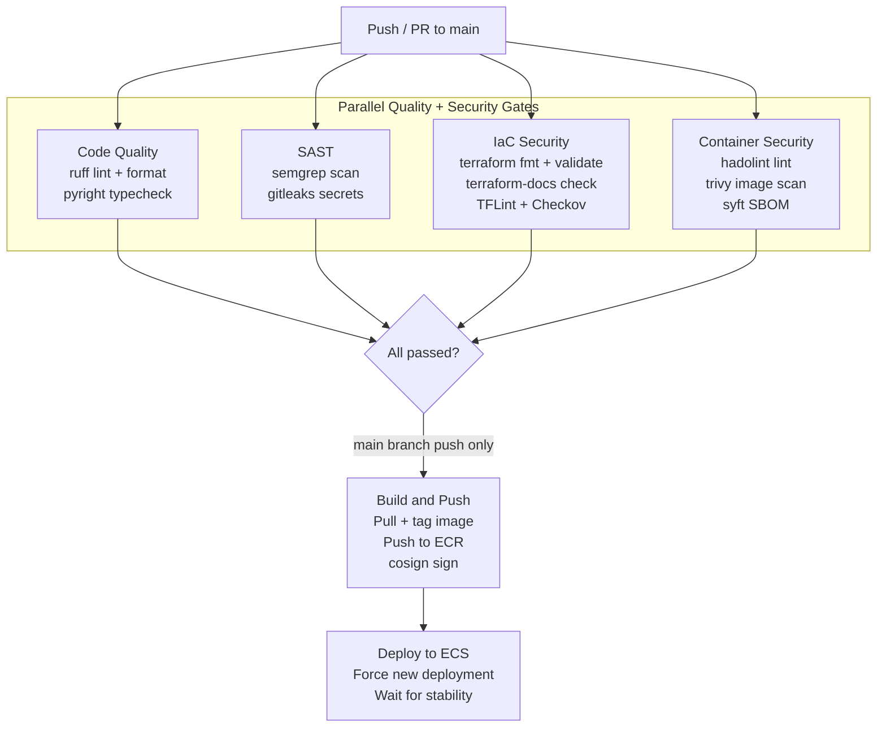
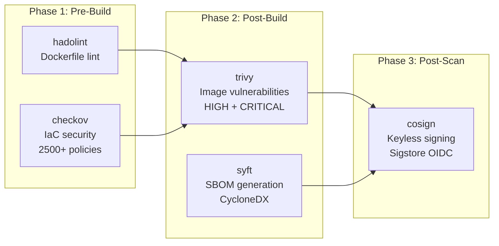

AI Gateway uses GitHub Actions for continuous integration and deployment. The main CI pipeline runs on every push and pull request to `main`, with additional workflows for code analysis, dependency review, releases, and supply-chain scoring.

## Pipeline Overview

The CI pipeline has 6 jobs. The first 4 run in parallel as quality and security gates. The build and deploy jobs run sequentially, gated on all 4 passing.



:::note[PR vs. push behavior]
On pull requests, only the 4 gate jobs run. Build-and-push and deploy only execute on pushes to `main`.
:::


## Job Details

### 1. Code Quality

**Trigger**: Every push and PR to `main`.

| Step | What It Checks |
|------|---------------|
| ruff check | Lint Python code (30+ rule sets, `--output-format=github` for inline annotations) |
| ruff format --check | Verify code formatting matches ruff standards |
| pyright | Type check `src/` in standard mode |

**Fails when**: Any lint violation, formatting difference, or type error is found.

### 2. SAST (Static Application Security Testing)

**Trigger**: Every push and PR to `main`.

| Step | What It Checks |
|------|---------------|
| Semgrep | Python code against OWASP Top 10, security audit, and Python-specific rules |
| Gitleaks | Repository history for leaked secrets, API keys, and credentials |

**Fails when**: Semgrep finds a security issue or gitleaks detects a secret.

### 3. IaC Security

**Trigger**: Every push and PR to `main`.

| Step | What It Checks |
|------|---------------|
| terraform fmt -check | Terraform files are properly formatted |
| terraform validate | Terraform configuration is syntactically valid |
| terraform-docs | Generated documentation in `infrastructure/README.md` is up to date |
| TFLint | Terraform linting with AWS ruleset (naming conventions, documented variables, unused declarations) |
| Checkov | 2,500+ Terraform security policies (output as SARIF, uploaded to GitHub Security tab) |

**Fails when**: Any formatting issue, validation error, outdated docs, lint violation, or Checkov policy failure.

### 4. Container Security

**Trigger**: Every push and PR to `main`.

| Step | What It Checks |
|------|---------------|
| Hadolint | Dockerfile best practices (ShellCheck integration, SARIF output) |
| Trivy | Vulnerability scan of the agentgateway data-plane image (CRITICAL + HIGH, exit code 1 on findings) |
| Syft | SBOM generation in CycloneDX format (uploaded as artifact, 90-day retention) |

**Fails when**: Hadolint finds violations, or trivy finds CRITICAL/HIGH vulnerabilities in the container image.

### 5. Build and Push

**Trigger**: Push to `main` only (not PRs). **Requires**: All 4 gate jobs passed.

| Step | What It Does |
|------|-------------|
| Configure AWS credentials | OIDC-based assume-role (no long-lived keys) |
| Login to ECR | Authenticate with Amazon ECR |
| Build gateway image | Re-tag the pinned upstream agentgateway image by digest (`Dockerfile` with `AGENTGATEWAY_REF` / `AGENTGATEWAY_VERSION` / `AGENTGATEWAY_IMAGE=ghcr.io/agentgateway/agentgateway@<digest>` build args from `versions.env`) |
| Tag + push | Tag with the commit SHA and `latest`, push to ECR |
| cosign sign | Keyless image signing via Sigstore OIDC |

### 6. Deploy to ECS

**Trigger**: Push to `main` only. **Requires**: Build-and-push completed. **Environment**: `production`.

| Step | What It Does |
|------|-------------|
| Force new deployment | `aws ecs update-service --force-new-deployment` |
| Wait for stability | `aws ecs wait services-stable` (10-minute timeout) |

## Security Pipeline Phases

The security scanning follows the 3-phase architecture from [ADR-004](/ai-gateway/adrs/004-security-pipeline-composition/):



## Additional Workflows

Beyond the main CI pipeline, 4 additional workflows provide continuous security monitoring.

### CodeQL Analysis

**File**: `.github/workflows/codeql.yml`

| Aspect | Detail |
|--------|--------|
| Trigger | Push to `main`, PRs to `main`, weekly schedule (Monday 06:15 UTC) |
| Languages | Python |
| Query suites | `security-and-quality` (extended rules) |
| Output | SARIF uploaded to GitHub Security tab |

CodeQL performs deep semantic analysis of Python code, detecting vulnerabilities that pattern-based tools like semgrep may miss.

### Dependency Review

**File**: `.github/workflows/dependency-review.yml`

| Aspect | Detail |
|--------|--------|
| Trigger | Pull requests to `main` only |
| Fail threshold | HIGH severity vulnerabilities |
| Denied licenses | GPL-3.0, AGPL-3.0 (and `-only`, `-or-later` variants) |
| PR comments | Summary posted on every PR |

Blocks PRs that introduce vulnerable or incompatibly-licensed dependencies.

### Release

**File**: `.github/workflows/release.yml`

| Aspect | Detail |
|--------|--------|
| Trigger | Tag push matching `v*` (e.g., `v1.0.0`, `v1.1.0-rc.1`) |
| Image tags | `v*` tag, SHA, and `latest` pushed to ECR |
| Signing | cosign keyless signing |
| SBOMs | Dual format: CycloneDX JSON + SPDX JSON |
| GitHub Release | Auto-generated changelog, container image digest, verification command |
| Pre-release | Tags containing `-rc`, `-beta`, or `-alpha` are marked as pre-release |

### OpenSSF Scorecard

**File**: `.github/workflows/scorecard.yml`

| Aspect | Detail |
|--------|--------|
| Trigger | Push to `main`, branch protection rule changes, weekly schedule (Monday 07:30 UTC) |
| Output | SARIF uploaded to GitHub Security tab, score published to scorecard.dev |

Evaluates the repository against [OpenSSF best practices](https://scorecard.dev/) for supply chain security.

## Dependabot Configuration

Dependabot monitors 3 ecosystems for outdated dependencies. All checks run weekly on Mondays at 08:00 Eastern.

| Ecosystem | Directory | PR Limit | Grouping | Commit Prefix |
|-----------|-----------|----------|----------|---------------|
| pip (Python) | `/` | 10 | Minor + patch grouped | `deps(python):` |
| Terraform | `/infrastructure` | 5 | Minor + patch grouped | `deps(terraform):` |
| GitHub Actions | `/` | 10 | Minor + patch grouped | `deps(actions):` |

All Dependabot PRs are assigned to `@theagenticguy` and labeled by ecosystem.

## Release Process

To create a release:

1. Ensure `main` is in a releasable state (all CI passing).
2. Create and push a version tag:

    ```bash
    git tag v1.0.0
    git push origin v1.0.0
    ```

3. The release workflow automatically:
    - Re-tags the pinned upstream agentgateway image (by digest) with the version.
    - Pushes to ECR with version, SHA, and `latest` tags.
    - Signs the image with cosign (keyless via Sigstore OIDC).
    - Generates dual SBOMs (CycloneDX + SPDX).
    - Creates a GitHub Release with auto-generated changelog and SBOM attachments.

:::tip[Pre-release tags]
Tags containing `-rc`, `-beta`, or `-alpha` (e.g., `v1.0.0-rc.1`) are automatically marked as pre-release on GitHub.
:::


## Concurrency

Both the CI and CodeQL workflows use concurrency groups tied to `workflow + ref`. This means:

- A new push to the same branch cancels any in-progress run for that branch.
- Multiple branches can run in parallel.
- The `pages` deployment uses a dedicated concurrency group to prevent overlapping deploys.