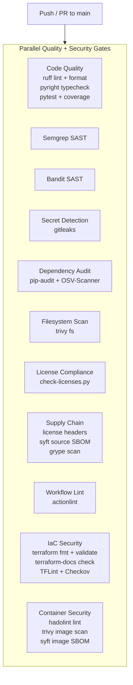
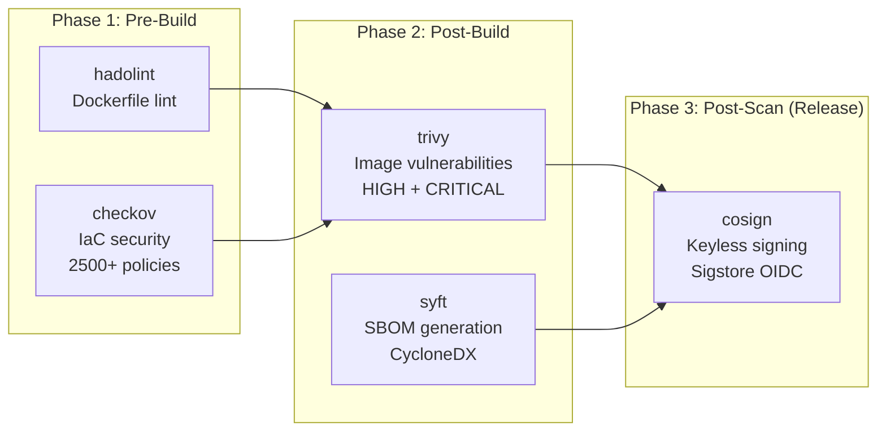

AI Gateway uses GitHub Actions for continuous integration and deployment. The main CI pipeline runs on every push and pull request to `main`, with additional workflows for code analysis, dependency review, releases, and supply-chain scoring.

## Pipeline Overview

The CI pipeline has 11 jobs. All of them run in parallel as quality and security gates on every push and PR to `main`. Image publishing and signing happen in the separate [Release workflow](#release), not in CI.


```mermaid
flowchart TD
    trigger[Push / PR to main] --> gates

    subgraph gates["Parallel Quality + Security Gates"]
        quality[Code Quality<br>ruff lint + format<br>pyright typecheck<br>pytest + coverage]
        semgrep[Semgrep SAST]
        bandit[Bandit SAST]
        gitleaks[Secret Detection<br>gitleaks]
        deps[Dependency Audit<br>pip-audit + OSV-Scanner]
        fs[Filesystem Scan<br>trivy fs]
        licenses[License Compliance<br>check-licenses.py]
        supply[Supply Chain<br>license headers<br>syft source SBOM<br>grype scan]
        wflint[Workflow Lint<br>actionlint]
        iac[IaC Security<br>terraform fmt + validate<br>terraform-docs check<br>TFLint + Checkov]
        container[Container Security<br>hadolint lint<br>trivy image scan<br>syft image SBOM]
    end
```


## Job Details

### 1. Code Quality

**Trigger**: Every push and PR to `main`.

| Step | What It Checks |
|------|---------------|
| ruff check | Lint Python code (30+ rule sets, `--output-format=github` for inline annotations) |
| ruff format --check | Verify code formatting matches ruff standards |
| pyright | Type check `src/` in standard mode |
| pytest | Run the test suite with coverage (uploaded to Codecov) |

**Fails when**: Any lint violation, formatting difference, type error, or test failure is found.

### 2. SAST and Secret Detection

**Trigger**: Every push and PR to `main`. Three separate jobs.

| Job | What It Checks |
|------|---------------|
| Semgrep SAST | Python code against OWASP Top 10, security audit, and Python-specific rules |
| Bandit SAST | Python security linting (SARIF upload, report-only via `--exit-zero`) |
| Secret Detection | Gitleaks scans repository history for leaked secrets, API keys, and credentials |

**Fails when**: Semgrep finds a security issue or gitleaks detects a secret.

### 3. Dependency Audit

**Trigger**: Every push and PR to `main`.

| Step | What It Checks |
|------|---------------|
| pip-audit | Locked Python dependencies (`uv export`) against known vulnerability databases (`--strict`) |
| OSV-Scanner | `uv.lock` and `docs/pnpm-lock.yaml` against the OSV database (SARIF upload) |

**Fails when**: pip-audit finds a known vulnerability in a locked dependency.

### 4. Filesystem Scan

**Trigger**: Every push and PR to `main`.

| Step | What It Checks |
|------|---------------|
| Trivy fs | Repository filesystem for HIGH/CRITICAL vulnerabilities (SARIF upload) |

### 5. License Compliance

**Trigger**: Every push and PR to `main`.

| Step | What It Checks |
|------|---------------|
| License policy check | `./scripts/check-licenses.py` fails the build on any dependency license not on the allowlist. Strong and network copyleft (GPL, AGPL, SSPL, and related families) are denied by family; unrecognized license strings fail rather than pass. |
| Generate reports | `pip-licenses>=5` with `--from=mixed` produces JSON and Markdown license reports, uploaded as artifacts (7-day retention) |

**Fails when**: A dependency carries a license outside the allowlist, or a license string cannot be normalized to a known SPDX identifier.

### 6. Supply Chain

**Trigger**: Every push and PR to `main`.

| Step | What It Checks |
|------|---------------|
| License headers | `./scripts/check-license-headers.py` verifies every tracked `.py`/`.sh`/`.tf` file starts with `SPDX-License-Identifier: Apache-2.0` |
| Syft source SBOM | Generates `sbom/ai-gateway.cdx.json` (CycloneDX) and `sbom/ai-gateway.spdx.json` (SPDX) from the source tree, covering the Python and npm dependency graphs and pinned GitHub Actions |
| Grype scan | Scans the CycloneDX SBOM with `fail-build: true` at HIGH severity; accepted findings live in `.grype.yaml` with a reason and check date each |
| Upload SBOM | The `sbom-source` artifact is retained for 90 days |

**Fails when**: A source file is missing its SPDX line, or grype finds an unaccepted HIGH/CRITICAL vulnerability.

### 7. Workflow Lint

**Trigger**: Every push and PR to `main`.

| Step | What It Checks |
|------|---------------|
| actionlint | GitHub Actions workflow files for syntax errors, bad expressions, and shellcheck findings in `run:` blocks |

### 8. IaC Security

**Trigger**: Every push and PR to `main`.

| Step | What It Checks |
|------|---------------|
| terraform fmt -check | Terraform files are properly formatted |
| terraform validate | Terraform configuration is syntactically valid |
| terraform-docs | Generated documentation in `infrastructure/README.md` is up to date |
| TFLint | Terraform linting with AWS ruleset (naming conventions, documented variables, unused declarations) |
| Checkov | 2,500+ Terraform security policies (output as SARIF, uploaded to GitHub Security tab) |

**Fails when**: Any formatting issue, validation error, outdated docs, lint violation, or Checkov policy failure.

### 9. Container Security

**Trigger**: Every push and PR to `main`.

| Step | What It Checks |
|------|---------------|
| Hadolint | Dockerfile best practices (ShellCheck integration, SARIF output) |
| Trivy | Vulnerability scan of the agentgateway data-plane image (CRITICAL + HIGH, SARIF upload) |
| Syft | Image SBOM generation in CycloneDX format (uploaded as artifact, 90-day retention) |

**Fails when**: Hadolint finds violations in a Dockerfile.

## Security Pipeline Phases

The container security scanning follows the 3-phase architecture from [ADR-004](/ai-gateway/adrs/004-security-pipeline-composition/). Phase 3 (cosign signing) runs in the Release workflow rather than in CI.


```mermaid
flowchart LR
    subgraph "Phase 1: Pre-Build"
        H[hadolint<br>Dockerfile lint]
        CH[checkov<br>IaC security<br>2500+ policies]
    end

    subgraph "Phase 2: Post-Build"
        T[trivy<br>Image vulnerabilities<br>HIGH + CRITICAL]
        S[syft<br>SBOM generation<br>CycloneDX]
    end

    subgraph "Phase 3: Post-Scan (Release)"
        CO[cosign<br>Keyless signing<br>Sigstore OIDC]
    end

    H --> T
    CH --> T
    T --> CO
    S --> CO
```

Since ADR-004 was written the pipeline gained gates the original composition skipped: grype now rescans the source SBOM produced by syft, osv-scanner scans every lockfile in the tree, and the license policy, license header, and actionlint checks run as their own CI jobs. The `security` mise task runs the same set locally.

## Additional Workflows

Beyond the main CI pipeline, 6 additional workflows provide continuous security monitoring.

### CodeQL Analysis

**File**: `.github/workflows/codeql.yml`

| Aspect | Detail |
|--------|--------|
| Trigger | Push to `main`, PRs to `main`, weekly schedule (Monday 06:15 UTC) |
| Languages | Python |
| Query suites | `security-and-quality` (extended rules) |
| Output | SARIF uploaded to GitHub Security tab |

CodeQL performs deep semantic analysis of Python code, detecting vulnerabilities that pattern-based tools like semgrep may miss.

### Dependency Review

**File**: `.github/workflows/dependency-review.yml`

| Aspect | Detail |
|--------|--------|
| Trigger | Pull requests to `main` only |
| Fail threshold | HIGH severity vulnerabilities |
| Denied licenses | GPL-3.0, AGPL-3.0 (and `-only`, `-or-later` variants) |
| PR comments | Summary posted on every PR |

Blocks PRs that introduce vulnerable or incompatibly-licensed dependencies.

### Release

**File**: `.github/workflows/release.yml`

| Aspect | Detail |
|--------|--------|
| Trigger | Tag push matching `v*` (e.g., `v1.0.0`, `v1.1.0-rc.1`) |
| Image tags | `v*` tag and `latest` pushed to GHCR always; version, SHA, and `latest` pushed to ECR when AWS credentials are configured |
| Signing | cosign keyless signing |
| SBOMs | Dual format: CycloneDX JSON + SPDX JSON |
| GitHub Release | Auto-generated changelog, container image digest, verification command |
| Pre-release | Tags containing `-rc`, `-beta`, or `-alpha` are marked as pre-release |

### OpenSSF Scorecard

**File**: `.github/workflows/scorecard.yml`

| Aspect | Detail |
|--------|--------|
| Trigger | Push to `main`, branch protection rule changes, weekly schedule (Monday 07:30 UTC) |
| Output | SARIF uploaded to GitHub Security tab, score published to scorecard.dev |

Evaluates the repository against [OpenSSF best practices](https://scorecard.dev/) for supply chain security.

### Rescan on Advisory

**File**: `.github/workflows/rescan-on-advisory.yml`

| Aspect | Detail |
|--------|--------|
| Trigger | Daily schedule (06:00 UTC), manual dispatch |
| SBOM rescan | Grype (HIGH cutoff) + OSV-Scanner against the latest SBOM artifact and lockfiles |
| Image rescan | Rebuilds the pinned image and rescans it |
| Alerting | Opens a GitHub issue when a HIGH+ finding appears in the SARIF results |

Catches newly disclosed CVEs in already-shipped artifacts between dependency bumps.

### agentgateway Image Watcher

**File**: `.github/workflows/agentgateway-image-watcher.yml`

| Aspect | Detail |
|--------|--------|
| Trigger | Daily schedule (07:00 UTC), manual dispatch |
| Action | Polls upstream agentgateway releases; opens a PR bumping `AGENTGATEWAY_REF` + `AGENTGATEWAY_IMAGE_DIGEST` in `versions.env` when the pin is behind |
| Safety | Proposes only; a maintainer reviews every data-plane version change |

## Dependabot Configuration

Dependabot monitors 5 ecosystems for outdated dependencies. All checks run weekly on Mondays at 08:00 Eastern.

| Ecosystem | Directory | PR Limit | Grouping | Commit Prefix |
|-----------|-----------|----------|----------|---------------|
| pip (Python) | `/` | 10 | Minor + patch grouped | `deps(python):` |
| Terraform | `/infrastructure` | 5 | Minor + patch grouped | `deps(terraform):` |
| GitHub Actions | `/` | 10 | Minor + patch grouped | `deps(actions):` |
| npm (docs) | `/docs` | 10 | Minor + patch grouped | `deps(npm):` |
| Docker | `/` | 5 | Minor + patch grouped | `deps(docker):` |

All Dependabot PRs are assigned to `@theagenticguy` and labeled by ecosystem.

## Release Process

To create a release:

1. Ensure `main` is in a releasable state (all CI passing).
2. Create and push a version tag:

    ```bash
    git tag v1.0.0
    git push origin v1.0.0
    ```

3. The release workflow automatically:
    - Re-tags the pinned upstream agentgateway image (by digest) with the version.
    - Pushes to GHCR with version and `latest` tags, and to ECR (version, SHA, `latest`) when AWS credentials are configured.
    - Signs the image with cosign (keyless via Sigstore OIDC).
    - Generates dual SBOMs (CycloneDX + SPDX).
    - Creates a GitHub Release with auto-generated changelog and SBOM attachments.

:::tip[Pre-release tags]
Tags containing `-rc`, `-beta`, or `-alpha` (e.g., `v1.0.0-rc.1`) are automatically marked as pre-release on GitHub.
:::


## Concurrency

Both the CI and CodeQL workflows use concurrency groups tied to `workflow + ref`. This means:

- A new push to the same branch cancels any in-progress run for that branch.
- Multiple branches can run in parallel.
- The `pages` deployment uses a dedicated concurrency group to prevent overlapping deploys.