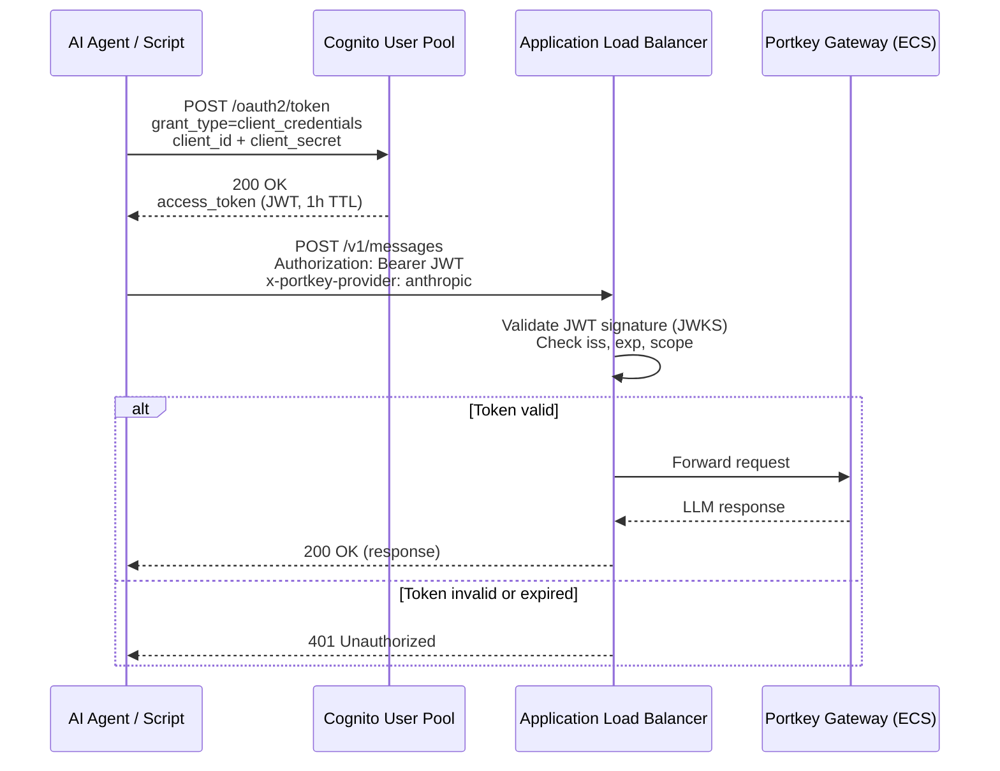

The AI Gateway uses **Cognito Machine-to-Machine (M2M)** authentication with the `client_credentials` OAuth2 grant. The ALB validates JWTs natively -- no API Gateway or custom authorizer required.

---

## How It Works

Cognito M2M authentication is designed for service-to-service communication where no human login is involved. Each client (agent, script, or service) is issued a **client ID** and **client secret**, which it exchanges for a short-lived JWT access token.

The ALB performs JWT validation at the edge: it checks the token signature against Cognito's JWKS endpoint, verifies `iss`, `exp`, `nbf`, `iat`, and the required `scope` claim. Invalid or expired tokens receive a `401 Unauthorized` response directly from the ALB -- the request never reaches the gateway container.

---

## Auth Flow



### Step-by-Step

1. **Token request** -- The client sends a `POST` to the Cognito `/oauth2/token` endpoint with `grant_type=client_credentials`, providing the client ID and secret.
2. **Token issuance** -- Cognito validates the credentials and returns a signed JWT access token with a 1-hour TTL and the `https://gateway.internal/invoke` scope.
3. **Request with Bearer token** -- The client includes the JWT in the `Authorization: Bearer <token>` header on every request to the gateway.
4. **ALB JWT validation** -- The ALB validates the token signature against Cognito's JWKS endpoint, checks standard claims (`iss`, `exp`, `nbf`, `iat`), and verifies the required scope. Invalid tokens are rejected with a `401` before reaching the backend.
5. **Forward to ECS** -- Valid requests pass through to the Portkey gateway container on ECS Fargate.

---

## Getting a Token

Use the provided script to obtain a token from the command line.

### Required Environment Variables

| Variable | Description |
|---|---|
| `GATEWAY_CLIENT_ID` | Cognito app-client ID (issued per team or service account) |
| `GATEWAY_CLIENT_SECRET` | Cognito app-client secret |
| `GATEWAY_TOKEN_ENDPOINT` | Full Cognito token URL, e.g. `https://<domain>.auth.<region>.amazoncognito.com/oauth2/token` |

Set these in your shell profile (`~/.zshrc` or `~/.bashrc`):

```bash
export GATEWAY_CLIENT_ID="<your-client-id>"
export GATEWAY_CLIENT_SECRET="<your-client-secret>"
export GATEWAY_TOKEN_ENDPOINT="<cognito-token-endpoint>"
```

### Using the Script

```bash
# Fetch a token (raw JWT printed to stdout)
TOKEN=$(./scripts/get-gateway-token.sh)

# Verify the token payload
echo "$TOKEN" | cut -d. -f2 | base64 -d 2>/dev/null | python3 -m json.tool
```

The script exits non-zero on failure and writes diagnostics to stderr:

| Exit Code | Meaning |
|---|---|
| `0` | Success |
| `1` | Missing environment variable |
| `2` | Token request failed (curl error or non-200 HTTP) |
| `3` | JSON parsing failed or `access_token` missing in response |

---

## Token Caching

Cognito JWTs have a default TTL of **3600 seconds** (1 hour). To avoid redundant token requests, cache the token and refresh before expiry.

### Claude Code

Claude Code handles caching automatically via `apiKeyHelper`:

1. `apiKeyHelper` is called once at startup to fetch the token.
2. `CLAUDE_CODE_API_KEY_HELPER_TTL_MS=3000000` (50 minutes) tells Claude Code to re-invoke the helper before the token expires.
3. On a `401` response, Claude Code immediately re-invokes the helper regardless of TTL.

No additional caching is needed.

### Shell Wrapper Pattern (Other Agents)

For agents that read API keys from environment variables (Goose, OpenCode, Codex CLI), use a caching wrapper:

```bash
#!/usr/bin/env bash
# ~/.local/bin/gateway-token-cached.sh
#
# Caches the gateway token in a file, refreshing when older than 50 minutes.

set -euo pipefail

CACHE_FILE="${HOME}/.cache/ai-gateway/token"
MAX_AGE=3000  # seconds (50 minutes)

mkdir -p "$(dirname "$CACHE_FILE")"

# Refresh if cache is missing or stale
if [[ ! -f "$CACHE_FILE" ]] || \
   [[ $(( $(date +%s) - $(stat -c %Y "$CACHE_FILE" 2>/dev/null || echo 0) )) -gt $MAX_AGE ]]; then
  ~/workplace/ai-gateway/scripts/get-gateway-token.sh > "$CACHE_FILE"
  chmod 600 "$CACHE_FILE"
fi

cat "$CACHE_FILE"
```

Then in your shell profile:

```bash
export OPENAI_API_KEY=$(~/.local/bin/gateway-token-cached.sh)
export GATEWAY_API_KEY=$(~/.local/bin/gateway-token-cached.sh)
```

:::tip[50-minute refresh window]
The 50-minute refresh threshold (vs. 60-minute TTL) provides a 10-minute buffer so the token never expires mid-request.
:::


---

## Next Steps

- [Agent Setup](../user-guide/agent-setup.md) -- Configure your AI agent to use the gateway
- [API Reference](../user-guide/api-reference.md) -- Endpoints, headers, and request formats