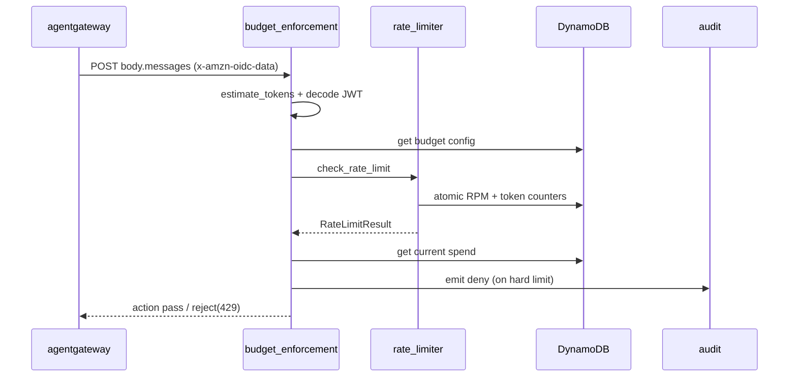
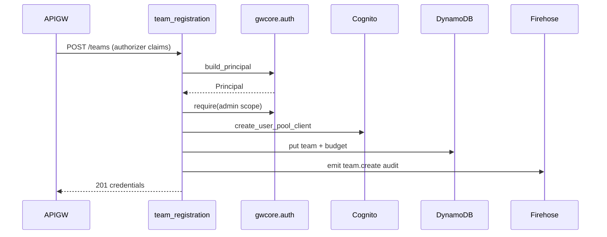
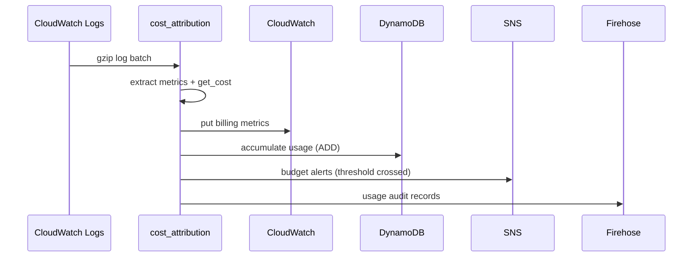

# ai-gateway · Data flow

This walk covers the three load-bearing request lifecycles in `ai-gateway`. Each package under `src/` exposes exactly one external-event entry point (`handler(event, _context)` or the pure `check_rate_limit` library), so the flows below are the actual call chains that advance an external event to its terminal side effect. Participant labels use the top-level package folder names (`architecture/module-map.md` was not present on disk at authoring time; the folder names are the substitute identifiers) plus the external AWS actors each flow touches.

## Flow 1: Inference pre-request gate

The data plane (agentgateway, a Rust container behind an ALB) calls this Lambda as a guardrail webhook before forwarding an inference request upstream. The Lambda always returns HTTP 200; the allow/deny rides inside the `action` envelope.

1. agentgateway POSTs `{"body": {"messages": [...]}}`; the Function URL handler opens a latency timer and parses the body `src/budget_enforcement/handler.py:380`.
2. The handler builds a `BudgetCheckRequest`, pulling the JWT from the forwarded `x-amzn-oidc-data` header and estimating tokens from the message text `src/budget_enforcement/handler.py:413`.
3. `estimate_tokens` flattens message content and divides chars by 4 to get a request-time token estimate `src/gwcore/agentgateway.py:58`.
4. `_check_budget` decodes JWT claims, then reads the team's budget config from the `gateway-budgets` DynamoDB table `src/budget_enforcement/handler.py:207`.
5. `check_rate_limit` enforces RPM + daily-token caps via atomic DynamoDB counters on the `gateway-usage` table `src/rate_limiter/handler.py:135`.
6. `_get_current_usage` reads the team's current-period spend from the `gateway-usage` table `src/budget_enforcement/handler.py:121`.
7. On a hard-limit breach the check returns a 429 deny, and `_audit_denial` emits a deny metric plus a `budget.enforce` audit event `src/budget_enforcement/handler.py:354`.
8. `_build_agentgateway_response` maps allow→`pass` or deny→`reject` into the action envelope returned to agentgateway `src/budget_enforcement/handler.py:432`.

## Flow 2: Control-plane API request

A representative control-plane API. API Gateway's Cognito authorizer verifies the token at the edge; the handler adds in-handler authorization, dispatches to a route, mutates Cognito + DynamoDB, and audits.

1. The Lambda handler resolves method + path, opens a latency timer, and enters the request pipeline `src/team_registration/handler.py:67`.
2. `auth.build_principal` reads the authorizer's verified claims (or decodes the bearer payload) into a `Principal` `src/gwcore/auth.py:131`.
3. `auth.require` enforces the admin scope, raising `ForbiddenError` if the principal lacks it `src/gwcore/auth.py:227`.
4. `_route` matches the method + path and dispatches to a route implementation `src/team_registration/handler.py:52`.
5. `register_team` validates the request body and checks the team name against a DynamoDB GSI `src/team_registration/routes.py:110`.
6. `_create_invoke_client` creates a Cognito app client with the `client_credentials`/invoke grant `src/team_registration/routes.py:92`.
7. The route writes team metadata and a seeded budget to the `gateway-teams` and `gateway-budgets` DynamoDB tables `src/team_registration/routes.py:133`.
8. `audit.emit` writes a `team.create` event to the Kinesis Firehose audit stream (Iceberg on S3 Tables) `src/gwcore/audit.py:64`.

## Flow 3: Cost-attribution / usage pipeline

An event-driven pipeline, not an HTTP request. A CloudWatch Logs subscription streams gateway access logs to this Lambda, which derives per-request cost, publishes billing metrics, accumulates usage, fires budget alerts, and writes usage records to the audit Firehose.

1. The handler opens a latency timer and enters the log-processing pipeline `src/cost_attribution/handler.py:598`.
2. `_decode_log_data` base64-decodes and gunzips the CloudWatch Logs subscription payload `src/cost_attribution/handler.py:130`.
3. `_extract_metrics` validates each log record, decodes the JWT identity, and computes cost via `pricing.get_cost` `src/cost_attribution/handler.py:134`.
4. `_publish_metrics` writes per-`[Provider,Model]` and per-`Team` billing metrics to CloudWatch `src/cost_attribution/handler.py:192`.
5. `_accumulate_usage` adds team-, user-, and model-level usage to the `gateway-usage` DynamoDB table with atomic `ADD` `src/cost_attribution/handler.py:288`.
6. `check_and_publish_alerts` detects newly crossed budget thresholds and publishes them to SNS `src/cost_attribution/handler.py:491`.
7. `_publish_audit_records` batches usage records to the Kinesis Firehose audit stream (Iceberg on S3 Tables) `src/cost_attribution/handler.py:558`.

## See also

- [behavior/processes](../behavior/processes.md) — 5 shared source citations
- [insights/contract-map](../insights/contract-map.md) — 5 shared source citations
- [insights/impact-analysis](../insights/impact-analysis.md) — 5 shared source citations
- [architecture/module-map](module-map.md) — 4 shared source citations
- [insights/business-logic](../insights/business-logic.md) — 4 shared source citations
