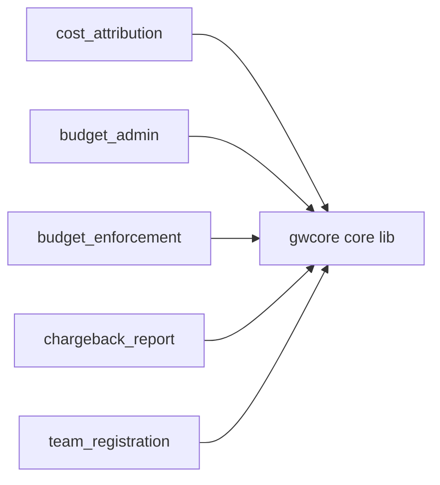

# ai-gateway · System overview

`ai-gateway` is a lightweight LLM inference gateway on AWS that routes AI-agent requests through the open-source `agentgateway` proxy to multiple model providers — Bedrock, OpenAI, Anthropic, Google, and Azure OpenAI — behind one unified API (`pyproject.toml:4`, `README.md:11`). It serves both the OpenAI Chat Completions format (`/v1/chat/completions`) and the Anthropic Messages format (`/v1/messages`) natively, so every major coding agent — Claude Code, OpenCode, Goose, Continue.dev, LangChain, and Codex CLI — works without adaptation (`README.md:228-237`). Its users are internal engineering teams who need governed, cost-attributed, budget-enforced access to frontier models through a single endpoint. Authentication uses Cognito machine-to-machine (`client_credentials`) with ALB-native JWT validation, which removes API Gateway from the inference hot path and adds zero per-request cost (`README.md:13`).

The deployment splits into two planes (`README.md:26`). The **data plane** is the `agentgateway` container on ECS Fargate, pinned by digest from the upstream image (`Dockerfile:23`) and serving on port 8787 with readiness on 15021 (`Dockerfile:29`, `infrastructure/modules/compute/main.tf:375`); it carries inference traffic behind an ALB with WAF and JWT validation. The **control plane** is a set of Python Lambda services under `src/` behind an API Gateway REST API with a Cognito authorizer. All control-plane code shares one package, `gwcore`, the largest module at 9 files and 999 LOC (`src/gwcore/__init__.py:1`); it supplies a single auth path, a consistent response/error/pagination contract, in-process caching, an append-only audit trail, and EMF metrics plus structured logging (`src/gwcore/__init__.py:1-9`). Every service imports it (`README.md:26`).

The remaining top modules are the busiest services. `cost_attribution` (1198 LOC) is a CloudWatch Logs subscription Lambda that parses gateway access logs, derives per-request cost and token metrics, accumulates usage in DynamoDB, and fires budget alerts (`src/cost_attribution/handler.py:1-13`). `budget_admin` (5 files, 884 LOC) is the CRUD API for budgets and usage queries (`src/budget_admin/handler.py:13-20`). `budget_enforcement` is an `agentgateway` guardrail webhook: the data plane calls it before forwarding a request and it returns a `pass`/`reject` action, always over HTTP 200 (`src/budget_enforcement/handler.py:1-8`). It calls `rate_limiter.check_rate_limit` on the hot path (`src/budget_enforcement/handler.py:51`) — `rate_limiter` is a pure library with no handler of its own (`src/rate_limiter/handler.py:1-9`). `chargeback_report` is a Step-Functions-triggered Lambda that generates monthly HTML cost reports into S3 (`src/chargeback_report/handler.py:1-8`), and `team_registration` is the self-service team onboarding API (`src/team_registration/handler.py:1-9`).

The `agentgateway`-webhook contract that ties data plane to control plane lives in `gwcore.agentgateway` (`src/gwcore/agentgateway.py:1-5`), which shapes the `{action}` envelopes the proxy expects. Supporting services not shown as top modules include `pricing_admin` (dynamic price overrides layered over `cost_attribution.pricing`, `src/pricing_admin/handler.py:25`), `routing_config`, `usage_api`, `pre_token` (a Cognito trigger mapping IdP groups to claims), and `admin_token`. Infrastructure is Terraform across 18 modules under `infrastructure/modules/` composed from `infrastructure/main.tf:14-367`. A reader new to the system should open `README.md`, then `src/gwcore/__init__.py`, then any one `handler.py` to see the shared contract in practice.

## Stack

| Layer | Technology | Source |
|-------|-----------|--------|
| Language | Python `>=3.13` | `pyproject.toml:5` |
| Runtime deps | boto3, pydantic, pyjwt[crypto], email-validator | `pyproject.toml:6-11` |
| Data plane | agentgateway (Rust proxy, digest-pinned) | `Dockerfile:23` |
| Compute | AWS ECS Fargate, port 8787 | `infrastructure/modules/compute/main.tf:375` |
| Test / lint | pytest, ruff, pyright, hypothesis, atheris | `pyproject.toml:14-24` |
| IaC | Terraform `~> 1.14`, AWS provider `~> 6.22` | `infrastructure/versions.tf:2-7` |
| Toolchain | mise-pinned Python 3.13, Terraform 1.14.8 | `mise.toml:5`, `mise.toml:17` |
| Auth | Cognito M2M + ALB-native JWT validation | `README.md:13` |
| Control-plane lib | gwcore shared package (auth, audit, telemetry) | `src/gwcore/__init__.py:1-9` |
| Guardrail contract | agentgateway webhook helpers | `src/gwcore/agentgateway.py:1-5` |

## Module map

## See also

- [insights/tech-debt](../insights/tech-debt.md) — 4 shared source citations
- [diagrams/architecture/components](../diagrams/architecture/components.md) — 3 shared source citations
- [diagrams/structural/dependency-graph](../diagrams/structural/dependency-graph.md) — 3 shared source citations
- [insights/impact-analysis](../insights/impact-analysis.md) — 3 shared source citations
- [architecture/data-flow](data-flow.md) — 2 shared source citations
