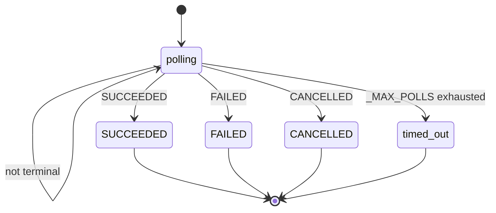
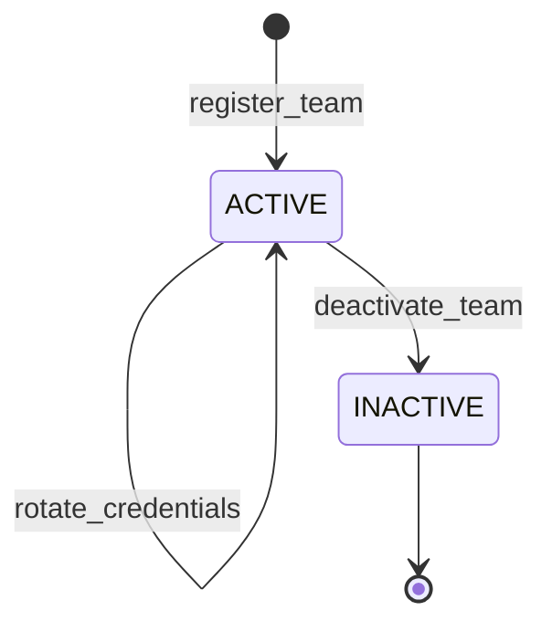

# ai-gateway · State machines

## Athena audit query execution

The `GET /audit` read path starts an asynchronous Athena query and polls
`GetQueryExecution` until the reported `State` reaches a terminal value. The
handler branches on the verbatim AWS Athena `QueryExecution.State` literals
`SUCCEEDED`, `FAILED`, and `CANCELLED`; any other value re-enters the poll loop
after sleeping, and exhausting `_MAX_POLLS` raises a timeout.

- `SUCCEEDED` is branched on at `src/budget_admin/audit_query.py:171`; `FAILED` and `CANCELLED` at `src/budget_admin/audit_query.py:173`.
- `polling` is the poll-loop transient (the default branch that sleeps `_POLL_INTERVAL_SECONDS` and re-reads `State`, `src/budget_admin/audit_query.py:167`); the AWS non-terminal states (`QUEUED`, `RUNNING`) are not branched on individually in source, so they are not drawn as distinct states.
- `timed_out` is the `_MAX_POLLS` exhaustion path that raises "Audit query timed out" (`src/budget_admin/audit_query.py:179`); `_MAX_POLLS` is defined at `src/budget_admin/audit_query.py:43`.

Defined at: `src/budget_admin/audit_query.py:161`

## Team lifecycle status

A team is created `ACTIVE` and can be deactivated to `INACTIVE`. Credential
rotation is a self-loop that leaves status `ACTIVE`. Deactivation deletes the
Cognito app client (revoking all tokens) and is terminal — no reactivation route
exists, and both rotation and a second deactivation are rejected once `INACTIVE`.

- `register_team` writes `status = TeamStatus.ACTIVE` (`src/team_registration/routes.py:110`, `:140`).
- `rotate_credentials` rotates the Cognito client and leaves status `ACTIVE`; it raises when the team is already `INACTIVE` (`src/team_registration/routes.py:282`, guard at `:288`).
- `deactivate_team` sets `status = TeamStatus.INACTIVE` via `update_item` and raises when already `INACTIVE` (`src/team_registration/routes.py:338`, guard at `:344`, write at `:362`).

Defined at: `src/team_registration/models.py:19`

## See also

- [architecture/module-map](../architecture/module-map.md) — 3 shared source citations
- [behavior/processes](processes.md) — 3 shared source citations
- [insights/business-logic](../insights/business-logic.md) — 3 shared source citations
- [insights/contract-map](../insights/contract-map.md) — 3 shared source citations
- [insights/impact-analysis](../insights/impact-analysis.md) — 3 shared source citations
