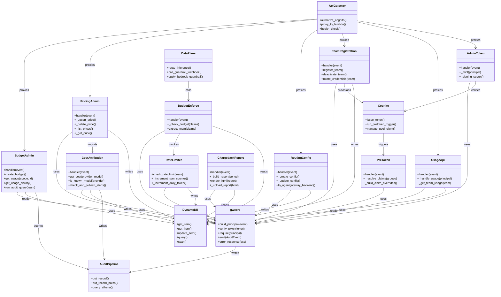

# ai-gateway · Components

## Legend

| Node | Kind | Role | Source |
| --- | --- | --- | --- |
| `gwcore` | Shared library | Auth (`Principal`, `build_principal`, `verify_token`, `require`), response/pagination envelope (`ok`, `error_response`, `page`), audit (`emit`), errors, `TTLCache`, telemetry, structured logging | `src/gwcore/__init__.py:1-40`, `auth.py:46-242`, `responses.py:39-146`, `audit.py:42-119` |
| `AdminToken` | Lambda service | `POST /auth/token`: exchange SSO session for short-lived gateway JWT | `src/admin_token/handler.py:1-32,109` |
| `PreToken` | Lambda service | Cognito pre-token-generation V2 trigger: IdP groups to gateway claims | `src/pre_token/handler.py:1-25,69` |
| `BudgetAdmin` | Lambda service | Budget CRUD + `GET /audit` (Athena) | `src/budget_admin/handler.py:1-40`, `audit_query.py:219` |
| `BudgetEnforce` | Lambda service | agentgateway guardrail webhook; pre-request budget + rate-limit gate | `src/budget_enforcement/handler.py:1-51,207,380` |
| `RateLimiter` | Library (no handler) | RPM + daily-token DynamoDB atomic counters | `src/rate_limiter/handler.py:1-30,135` |
| `CostAttribution` | Lambda service | CloudWatch Logs subscription: cost/token attribution, billing metrics, usage accumulation, SNS alerts; owns pricing table | `src/cost_attribution/handler.py:1-35,598`, `pricing.py:212-271` |
| `PricingAdmin` | Lambda service | Pricing-override CRUD merged over static pricing table | `src/pricing_admin/handler.py:1-30,245` |
| `RoutingConfig` | Lambda service | Provider-routing-strategy CRUD, rendered as agentgateway backend | `src/routing_config/handler.py:1-31,269`, `models.py:119` |
| `TeamRegistration` | Lambda service | Self-service team onboarding + Cognito client rotation | `src/team_registration/handler.py:1-26`, `routes.py:94-352` |
| `UsageApi` | Lambda service | Read-only team usage with tenant isolation | `src/usage_api/handler.py:1-26,205` |
| `ChargebackReport` | Lambda service | Step-Functions monthly HTML chargeback report to S3 | `src/chargeback_report/handler.py:1-26,212` |
| `DataPlane` | Infra plane | agentgateway on ECS Fargate behind ALB; guardrail webhook + Bedrock guardrail inline | `README.md:11,22,187`, `infrastructure/main.tf:151-193` |
| `ApiGateway` | Infra plane | Control-plane REST API with Cognito authorizer, AWS_PROXY per Lambda, MOCK health check on root | `README.md:26`, `infrastructure/modules/admin_api/main.tf:17-117` |
| `Cognito` | Infra plane | User pool + authorizer, pre-token trigger, per-team app clients | `infrastructure/main.tf:58-93`, `modules/auth/pre_token_lambda.tf:2-15` |
| `DynamoDB` | Infra plane | `usage` / `budgets` / config tables (single-table access) | `infrastructure/main.tf:259-275`; ops in `src/*/handler.py` |
| `AuditPipeline` | Infra plane | Kinesis Firehose to Apache Iceberg on S3 Tables; Athena read surface | `README.md:26`, `infrastructure/main.tf:302-360`, `src/gwcore/audit.py:64-85` |

Node method entries are grounded public functions/methods: `gwcore` (`src/gwcore/auth.py:131,164,227`, `audit.py:64`, `responses.py:74`); `RateLimiter._increment_*` (`src/rate_limiter/handler.py:44,82`); `CostAttribution.get_cost/is_known_model/check_and_publish_alerts` (`src/cost_attribution/pricing.py:232,265`, `handler.py:491`); `RoutingConfig.to_agentgateway_backend` (`src/routing_config/models.py:119`); `TeamRegistration.register_team/rotate_credentials/deactivate_team` (`src/team_registration/routes.py`); `AuditPipeline.put_record/put_record_batch/query_athena` (`src/gwcore/audit.py:77`, `cost_attribution/handler.py:587`, `budget_admin/audit_query.py:152,239`); `Cognito.manage_pool_client` (`src/team_registration/routes.py:94,296`). Infra-plane method labels name AWS-managed operations these components exercise; the underlying calls are cited here.

Not drawn (folded into this Legend to keep edges legible): Observability plane — CloudWatch EMF metrics + OTEL, receiving `gwcore.telemetry.emit_metric` from every service (`src/gwcore/telemetry.py:19-114`, `infrastructure/main.tf:14-32`). All 11 services emit to it, so a node would add 11 near-identical edges without adding structural information.

## See also

- [architecture/module-map](../../architecture/module-map.md) — 10 shared source citations
- [behavior/processes](../../behavior/processes.md) — 9 shared source citations
- [insights/contract-map](../../insights/contract-map.md) — 9 shared source citations
- [insights/impact-analysis](../../insights/impact-analysis.md) — 9 shared source citations
- [diagrams/structural/dependency-graph](../structural/dependency-graph.md) — 6 shared source citations
