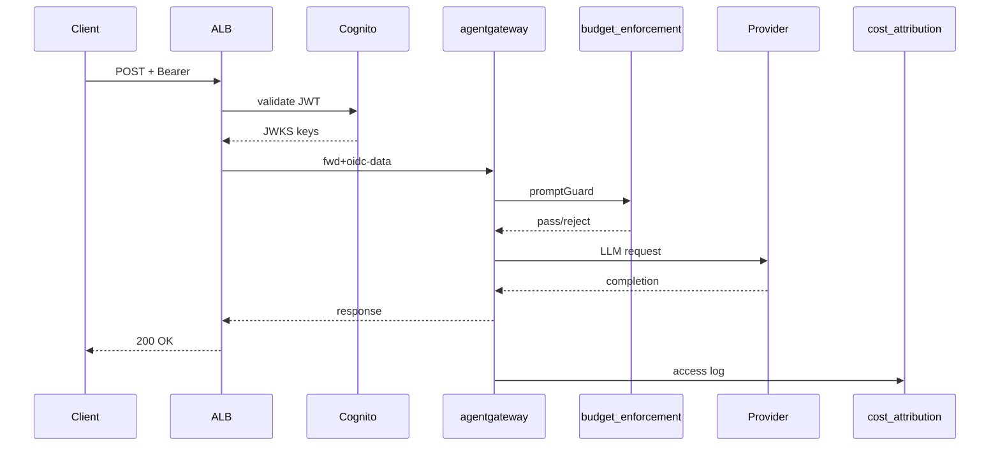
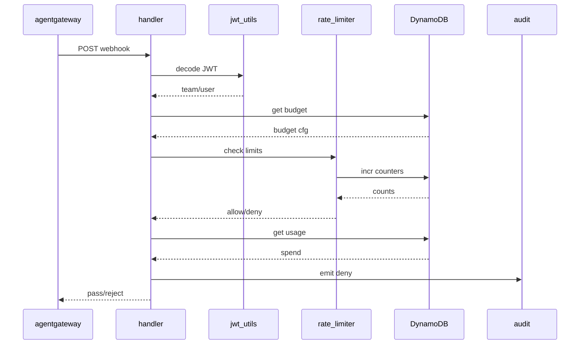
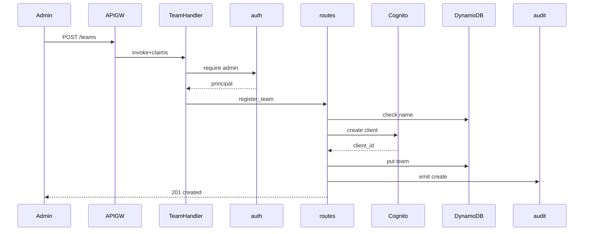

# ai-gateway · Sequences

## Inference request

```mermaid
sequenceDiagram
    participant Client
    participant ALB
    participant Cognito
    participant agentgateway
    participant budget_enforcement
    participant Provider
    participant cost_attribution

    Client->>ALB: POST + Bearer
    ALB->>Cognito: validate JWT
    Cognito-->>ALB: JWKS keys
    ALB->>agentgateway: fwd+oidc-data
    agentgateway->>budget_enforcement: promptGuard
    budget_enforcement-->>agentgateway: pass/reject
    agentgateway->>Provider: LLM request
    Provider-->>agentgateway: completion
    agentgateway-->>ALB: response
    ALB-->>Client: 200 OK
    agentgateway->>cost_attribution: access log
```

## Budget enforcement

```mermaid
sequenceDiagram
    participant agentgateway
    participant handler
    participant jwt_utils
    participant rate_limiter
    participant DynamoDB
    participant audit

    agentgateway->>handler: POST webhook
    handler->>jwt_utils: decode JWT
    jwt_utils-->>handler: team/user
    handler->>DynamoDB: get budget
    DynamoDB-->>handler: budget cfg
    handler->>rate_limiter: check limits
    rate_limiter->>DynamoDB: incr counters
    DynamoDB-->>rate_limiter: counts
    rate_limiter-->>handler: allow/deny
    handler->>DynamoDB: get usage
    DynamoDB-->>handler: spend
    handler->>audit: emit deny
    handler-->>agentgateway: pass/reject
```

## Team registration

```mermaid
sequenceDiagram
    participant Admin
    participant APIGW
    participant TeamHandler
    participant auth
    participant routes
    participant Cognito
    participant DynamoDB
    participant audit

    Admin->>APIGW: POST /teams
    APIGW->>TeamHandler: invoke+claims
    TeamHandler->>auth: require admin
    auth-->>TeamHandler: principal
    TeamHandler->>routes: register_team
    routes->>DynamoDB: check name
    routes->>Cognito: create client
    Cognito-->>routes: client_id
    routes->>DynamoDB: put team
    routes->>audit: emit create
    routes-->>Admin: 201 created
```