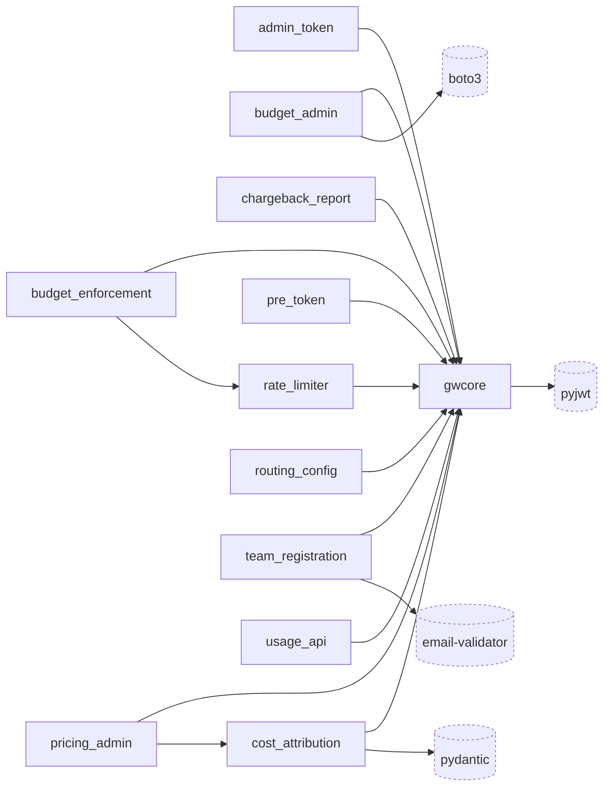

# ai-gateway · Dependency graph

Internal modules are the 12 packages under `src/`; `gwcore` is the shared hub every Lambda service imports (`src/gwcore/__init__.py:13-22`). External nodes are the 4 direct runtime dependencies declared in `pyproject.toml:6-11`, drawn with dashed borders. Each external edge originates at the internal module whose files import that dependency most often.

## Notes

- `gwcore` is a sink, not a source: it imports no sibling service package and depends only on the standard library plus `boto3` (`src/gwcore/audit.py:20`) and `pyjwt` (`src/gwcore/auth.py:28-29`). All 11 other packages import it (`src/usage_api/handler.py:23`, `src/routing_config/handler.py:27`, and the nine other handlers/routes).
- Only two internal edges bypass `gwcore`: `budget_enforcement -> rate_limiter` (`src/budget_enforcement/handler.py:51`) and `pricing_admin -> cost_attribution` (`src/pricing_admin/handler.py:25`).
- `pydantic` is the most-imported external dependency (11 of 12 packages; every one except `gwcore`); the edge is sourced at `cost_attribution`, its heaviest importer with 3 files (`src/cost_attribution/models.py:9`, `pricing.py:11`, `handler.py:30`).
- `email-validator` (`pyproject.toml:8`) has no direct `import` in `src/`; it is pulled in transitively through `pydantic.EmailStr`, used only in `src/team_registration/models.py:7,43`, so its edge originates at `team_registration`.

## See also

- [architecture/module-map](../../architecture/module-map.md) — 6 shared source citations
- [behavior/processes](../../behavior/processes.md) — 5 shared source citations
- [insights/contract-map](../../insights/contract-map.md) — 5 shared source citations
- [insights/impact-analysis](../../insights/impact-analysis.md) — 5 shared source citations
- [insights/tech-debt](../../insights/tech-debt.md) — 5 shared source citations
